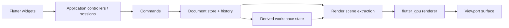

# Architecture Blueprint

## Core Decision

Build one pure Flutter codebase with a strict internal boundary between:

- domain state
- application commands and sessions
- rendering
- infrastructure
- widgets

The rewrite should remove the native host/backend split, but it should not collapse those concerns into one widget tree.

## Recommended Repository Layout

```text
app/
  lib/
    main.dart
    bootstrap/
    shell/
    routing/
packages/
  sdf_modeler_domain/
  sdf_modeler_application/
  sdf_modeler_rendering/
  sdf_modeler_infrastructure/
  sdf_modeler_widgets/
  sdf_modeler_benchmarks/
tool/
docs/
```

## Package Responsibilities

### `sdf_modeler_domain`

- Scene graph entities and stable ids
- Document model
- Selection model
- Undo/redo primitives
- Math and geometry helpers that do not depend on Flutter widgets
- Tool-independent validation rules

### `sdf_modeler_application`

- Editor commands
- Tool/session controllers
- Reducers or state coordinators
- Workspace snapshots and DTOs
- Dirty-region and invalidation policy
- Command history integration

### `sdf_modeler_rendering`

- Scene extraction from the document model
- GPU resource ownership
- Shader/material translation
- `flutter_gpu` pipelines, buffers, textures, and passes
- Viewport draw scheduler

### `sdf_modeler_infrastructure`

- Document serialization
- Settings persistence
- Import and export adapters
- Background worker entrypoints
- Isolate message DTOs

### `sdf_modeler_widgets`

- Editor shell and panels
- Property editors
- Shortcuts and menu presentation
- Viewport container widgets
- Inspector and outliner widgets

## Data Flow



## State Rules

- The document store is authoritative.
- Widgets render projections of application state. They do not own business rules.
- Controllers mutate state through commands or explicit session updates.
- Renderer state is derived and disposable. If the renderer is recreated, the document remains intact.
- Tool previews that are not yet committed still live in explicit session state, not in widget-local caches.

## Rendering Strategy

### Renderer boundary

The viewport widget should talk to a renderer facade, not directly to domain objects. The facade accepts compact scene snapshots or extracted render data.

### Invalidation model

Maintain at least three dirty classes:

- camera or viewport-only dirty
- material or draw-data dirty
- full scene extraction dirty

This preserves the current codebase's biggest performance win: not every state change should trigger the heaviest path.

### Resource lifetime

- Keep GPU resources inside `sdf_modeler_rendering`.
- Keep CPU-side scene data in immutable or versioned snapshots where practical.
- Avoid per-frame buffer churn for stable geometry.
- Treat upload allocators and transient uniform buffers as renderer-owned details.

## Interaction Model

Represent editor gestures as explicit sessions:

- `OrbitCameraSession`
- `PanCameraSession`
- `TransformSelectionSession`
- `SculptBrushSession`
- `BoxCreateSession`

Each session should expose a predictable lifecycle:

1. start from application state and pointer/key context
2. update from input deltas
3. emit previews and dirtiness
4. commit as commands or cancel cleanly

## Concurrency Model

Use Dart isolates for expensive operations:

- document import
- export mesh generation
- heavy save/load transforms
- large brush or voxel batch preprocessing when profiling justifies it

Do not put general UI state management behind isolates. Keep isolates focused on bounded CPU-heavy work.

## Serialization Model

Keep three layers distinct:

- domain entities used in memory
- file DTOs used for persistence
- renderer extraction structs used for drawing

Do not serialize widget state directly.

## Platform Scope

For v1, assume:

- primary targets: iOS and Android
- optional spike target: macOS only after mobile parity is stable
- defer web until a separate rendering feasibility pass is complete

That scope is a risk-management decision, not a product constraint. If desktop-first parity is required, run a renderer spike first and accept extra schedule risk.
