<a id="top"></a>

# Rebuilding SDF Modeler in React Native + WebGPU — Complete Guide

> A phased, beginner-friendly guide to understanding the existing Rust app **and** re-creating it as a mobile app with **React Native + Expo**, **`react-native-webgpu`**, and **TypeGPU**.
>
> This single document combines the full guide. It reads top-to-bottom as a course, but you can jump via the table of contents. Internal "Doc NN" references are links to the matching section below.

## Table of contents

- [00 · Orientation — The Mental Model](#doc-00)
- [01 · WebGPU + Expo Setup From Zero](#doc-01)
- [02 · Your First Shader](#doc-02)
- [03 · Raymarching 101 — Draw a Sphere From Math](#doc-03)
- [04 · The Scene Data Model](#doc-04)
- [05 · Runtime Codegen — Turn Scene Data Into a Shader](#doc-05)
- [06 · Buffers, Camera & the Render Loop](#doc-06)
- [07 · Picking & Selection (Tap to Select)](#doc-07)
- [08 · Sculpting & Voxels (Digital Clay)](#doc-08)
- [09 · React Architecture & Practices](#doc-09)
- [Glossary](#glossary)


<a id="doc-00"></a>

---

## 00 · Orientation — The Mental Model

> **Goal:** Understand *what* the app does and *how its big pieces fit together* — without a single line of code. Once this clicks, the rest of the docs are just filling in details.

---

### 1. The one idea that makes this app different

Almost all 3D software draws shapes out of **triangles**. A sphere is really hundreds of tiny flat triangles arranged to *look* round. Zoom in far enough and you see the flat edges.

This app does something else. It describes a shape with a **formula** that answers one question:

> *"Given any point in 3D space, how far is it from the surface of my shape?"*

That formula is called a **Signed Distance Function**, or **SDF**.

- **Distance**: how far the point is from the surface.
- **Signed**: the sign tells you which side you're on. **Negative = inside** the shape, **positive = outside**, **zero = exactly on the surface**.

For a sphere of radius `r` centered at the origin, the formula is almost embarrassingly simple:

```
distance(point) = length(point) - r
```

If a point is 5 units from the center and the radius is 2, the distance to the surface is `5 - 2 = 3` (outside). If it's 1 unit from the center, it's `1 - 2 = -1` (inside).

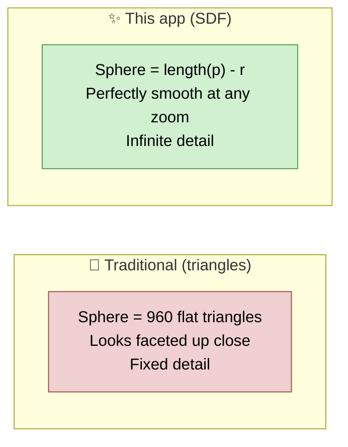

#### Why bother?

Because formulas **combine beautifully**. Want to glue two shapes together with a smooth, organic fillet where they meet? With triangles that's a hard geometry problem. With SDFs it's one line of math (a "smooth union"). Want to carve a sphere out of a box? Another line. This is called **CSG** — Constructive Solid Geometry — and SDFs make it trivial.

---

### 2. How do you actually *draw* a formula?

You can't send a formula to the screen directly. You use a technique called **raymarching** (specifically **sphere tracing**). The intuition:

For every pixel on screen, shoot a ray out from the camera into the 3D scene. Then "march" along that ray in steps until you hit a surface. The SDF tells you exactly how big a step is safe to take: *if the nearest surface is 3 units away, you can safely jump 3 units without passing through anything.* Repeat until the distance is basically zero — that's your hit point.

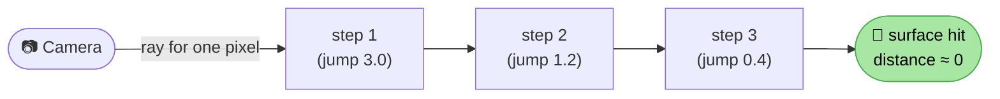

We cover this in full in **[Doc 03](#doc-03)**. For now, just hold the picture: *rays stepping through space, guided by the distance formula.*

---

### 3. The four big systems

The whole app, stripped to its essence, is four systems passing data to each other:

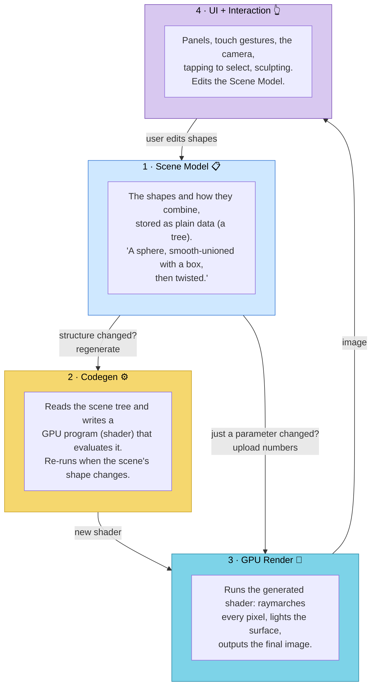

Read the arrows carefully — they contain one of the most important ideas in the app:

#### The "two-speed" insight

There are **two kinds of edits** a user can make, and they cost very different amounts:

1. **Structural change** — you *add* a shape, *delete* one, or *change how they connect* (e.g. switch a union to a subtraction). This changes the **shape of the scene tree**, so the generated shader is now wrong and must be **regenerated and recompiled**. This is the slow path (tens of milliseconds).

2. **Parameter change** — you *drag* a shape to move it, or change its color or radius. The tree's shape is the same; only **numbers** changed. We don't need a new shader — we just **upload the new numbers** to the GPU. This is the fast path (about a millisecond).

The app tracks these separately (the Rust code calls them `structure_version` and `data_version`). Getting this split right is what keeps the app responsive while you drag things around. We'll wire it up in **[Doc 06](#doc-06)**.

---

### 4. What sculpting adds

Formulas are great for clean geometric shapes, but you can't hand-sculpt a formula. So the app adds **voxel grids**: a 3D grid of distance values (think of a Minecraft-style cube of numbers) that you can paint into with a **brush**. The renderer samples this grid as just another kind of SDF.

This is the app's signature feature, and it has strict **responsiveness rules** (the brush must never feel laggy). We dedicate all of **[Doc 08](#doc-08)** to it.

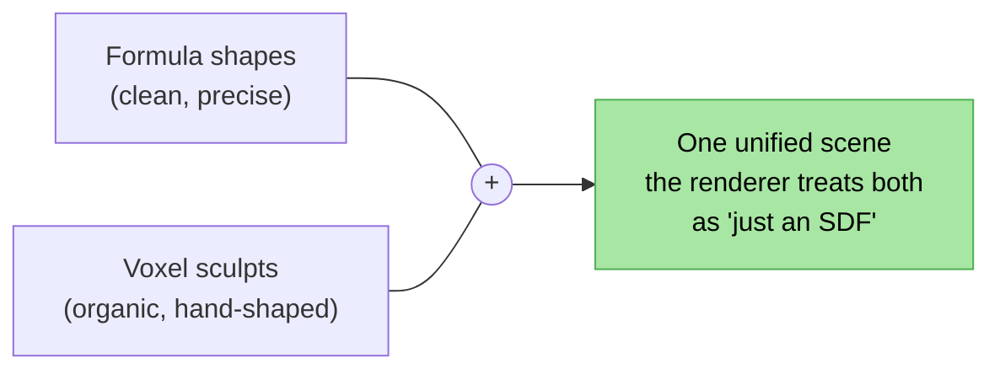

---

### 5. How the rebuild maps these systems to React Native

A quick preview so you know where everything will live. Don't memorize this — it's the destination, and [Doc 09](#doc-09) covers it properly.

| System | Rust app | Our React Native app |
| --- | --- | --- |
| Scene Model | `Scene` struct + `Action` reducer | A **Zustand store** (single source of truth) |
| Codegen | `codegen.rs` builds WGSL strings | A TS function that builds WGSL strings |
| GPU Render | `wgpu` + WGSL shaders | `react-native-webgpu` + **TypeGPU** + WGSL |
| UI + Interaction | `egui` panels + mouse | **React components** + `react-native-gesture-handler` |

One principle we borrow directly from the Rust app: **keep the GPU engine separate from the UI.** The engine is imperative (it owns the GPU, runs the frame loop). React is declarative (it describes panels). They talk through the store. The Rust codebase enforces this same `backend` / `frontend` split — it's good architecture, and we keep it.

---

### ✅ Checkpoint — you now understand

- **SDF**: a shape = a "distance to surface" formula; sign tells inside/outside.
- **Raymarching**: how you draw a formula — step rays through space using the distance as a safe step size.
- **CSG**: combining shapes with math (union, subtract, intersect, *smooth* versions).
- **The four systems**: Scene Model → Codegen → GPU Render → UI, in a loop.
- **Two-speed editing**: structural changes recompile a shader; parameter changes just upload numbers.
- **Sculpting**: voxel grids are "just another SDF" the renderer can sample.

No code yet — that starts next, where we get WebGPU running on your phone.

**Next: [01 · WebGPU + Expo Setup »](#doc-01)**


<a id="doc-01"></a>

---

## 01 · WebGPU + Expo Setup From Zero

> **Goal:** Understand what WebGPU actually is (and its vocabulary), then get a real WebGPU app running on a phone that fills the screen with a solid color. This is the "hello world" that proves your whole toolchain works.

---

### Part A — What is WebGPU? (concepts first)

#### CPU vs GPU

Your **CPU** is a few very fast, very flexible cores. It runs your JavaScript, your React components, your app logic. Great at doing complicated things one (or a few) at a time.

Your **GPU** is *thousands* of simple cores. It's terrible at branching logic but astonishing at doing **the same small calculation on a huge amount of data at once**. Drawing a screen is exactly that: "compute a color for each of ~2 million pixels." Perfect GPU work.

**WebGPU** is the modern API for talking to the GPU from a JavaScript/TypeScript environment. It replaced the older WebGL. It's lower-level and more explicit, but also more powerful (it can do general-purpose **compute**, which we need for sculpting).

> 🧠 You write small programs called **shaders** that run *on the GPU*, once per pixel (or once per data element). The CPU's job is to *set up* the GPU's work and then say "go."

#### The vocabulary you must know

These five words appear constantly. Learn them now and the rest is easy.

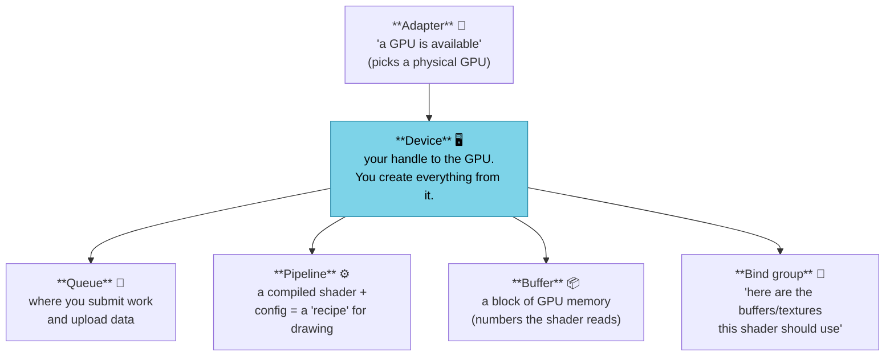

In plain words:

- **Adapter** — "I found a GPU." You ask the system for one.
- **Device** — your connection to that GPU. Everything else is created *from* the device (`device.createBuffer(...)`, `device.createRenderPipeline(...)`).
- **Queue** — the conveyor belt. You put work and data uploads on it; the GPU processes them.
- **Pipeline** — a **compiled shader** plus settings (what format the output is, etc.). Think "a saved drawing recipe."
- **Buffer** — raw GPU memory. Your shape data lives here as plain numbers.
- **Bind group** — the connector that says "shader, *these* buffers and textures are the ones you'll read this frame."

You'll meet **shaders** properly in [Doc 02](#doc-02), but the short version: a shader is a small program written in **WGSL** (WebGPU Shading Language — looks a bit like Rust/C). There are three kinds:

- **Vertex shader** — positions geometry.
- **Fragment shader** — computes the color of a pixel. *This is where our whole renderer lives.*
- **Compute shader** — general number-crunching, not tied to drawing. *We use this for picking and sculpting.*

#### Where TypeGPU fits

Raw WebGPU is verbose and easy to get subtly wrong (buffer byte layouts, bind-group indices, etc. — mismatch them and you get a silent black screen). **TypeGPU** is a TypeScript toolkit that adds **type safety** on top of WebGPU:

- You describe a buffer's layout *once* as a typed struct (`d.struct({...})`), and TypeGPU computes the byte layout for you.
- Bind groups and pipelines become type-checked — the compiler catches the mismatches that would otherwise be a black screen.
- You can even write shaders in TypeScript, and there's a `tgpu.simulate` CPU mode for unit-testing shader logic.

> **Our strategy (decided in the plan):** use **TypeGPU for everything static and structured** — buffers, bind groups, pipelines, the fixed shader modules. But for the *dynamic* `scene_sdf` function (which changes whenever the scene's shape changes), we'll generate **WGSL strings at runtime**, because the scene is data-driven. [Doc 05](#doc-05) explains why this hybrid is the right call. TypeGPU supports mixing in raw WGSL, so this works cleanly.

---

### Part B — The Expo toolchain (the annoying-but-once step)

Here is the honest truth, verified against the current `react-native-webgpu` and TypeGPU docs:

> ⚠️ **WebGPU on React Native does NOT run in Expo Go.** Expo Go is a fixed prebuilt app; it can't include the native WebGPU code. You must create a **custom development build** (a "dev client"). It's one extra command and then you develop normally.

#### Requirements

- **React Native 0.81+** with the **New Architecture** enabled (the default in current Expo).
- A physical device or emulator/simulator. (A real device is recommended — GPU behavior on emulators can be flaky.)

#### The packages

```bash
# 1. Create an Expo app (TypeScript template)
npx create-expo-app@latest sdf-modeler --template

cd sdf-modeler

# 2. The WebGPU native module (built on Google's Dawn engine)
npx expo install react-native-webgpu

# 3. TypeGPU + its build-time plugin
npm install typegpu
npm install -D unplugin-typegpu

# 4. TypeGPU on RN needs up-to-date reanimated + worklets
npx expo install react-native-reanimated react-native-worklets

# 5. Touch gestures (we'll use these for the camera in Doc 06)
npx expo install react-native-gesture-handler
```

#### Babel config

TypeGPU's plugin transforms your typed shader code at build time. Add it to `babel.config.js`:

```js
// babel.config.js
module.exports = function (api) {
  api.cache(true);
  return {
    presets: ['babel-preset-expo'],
    plugins: [
      'unplugin-typegpu/babel',
      'react-native-worklets/plugin', // must be LAST
    ],
  };
};
```

> After changing Babel config, **clear the Metro cache**: `npx expo start --clear`. Skipping this causes confusing "it didn't pick up my change" bugs.

#### Build and run the dev client

```bash
# Generate native iOS/Android projects
npx expo prebuild

# Build + install the dev client on a connected device/emulator
npx expo run:android      # or: npx expo run:ios
```

After this first build, your day-to-day loop is just `npx expo start` and the JS reloads instantly — same fast feedback as normal Expo.

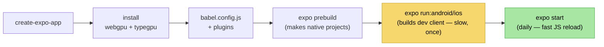

---

### Part C — Hello WebGPU: fill the screen with a color

This is the smallest program that proves everything works: get a device, attach to a `<Canvas>`, and clear it to a color every frame. No shapes yet — just a colored rectangle that confirms the GPU pipeline is alive.

```tsx
// App.tsx
import { Canvas, useGPUContext } from 'react-native-webgpu';
import { useEffect, useRef } from 'react';
import { StyleSheet } from 'react-native';

export default function App() {
  // The Canvas gives us a native surface to render onto.
  const ref = useRef<any>(null);

  return (
    <Canvas ref={ref} style={styles.canvas} onCreateSurface={onCreateSurface} />
  );
}

async function onCreateSurface({ context, canvas }: any) {
  // 1. ADAPTER — find a GPU.
  const adapter = await navigator.gpu.requestAdapter();
  if (!adapter) throw new Error('No WebGPU adapter — device unsupported.');

  // 2. DEVICE — our handle to the GPU. Everything is created from this.
  const device = await adapter.requestDevice();

  // 3. Tell the canvas context which device + pixel format to use.
  const format = navigator.gpu.getPreferredCanvasFormat();
  context.configure({ device, format, alphaMode: 'opaque' });

  // 4. RENDER ONE FRAME: clear the screen to a teal color.
  function frame() {
    // A command encoder records GPU commands.
    const encoder = device.createCommandEncoder();

    // A render pass that targets the canvas's current texture.
    const pass = encoder.beginRenderPass({
      colorAttachments: [
        {
          view: context.getCurrentTexture().createView(),
          clearValue: { r: 0.0, g: 0.5, b: 0.6, a: 1.0 }, // teal
          loadOp: 'clear',   // start by clearing to clearValue
          storeOp: 'store',  // keep the result
        },
      ],
    });
    pass.end(); // we draw nothing yet — just the clear

    // 5. QUEUE — submit the recorded commands to the GPU.
    device.queue.submit([encoder.finish()]);
    context.present();
  }

  frame();
}

const styles = StyleSheet.create({ canvas: { flex: 1 } });
```

> 📝 The exact `Canvas` API (`onCreateSurface` vs hooks) shifts between `react-native-webgpu` versions. Check the [official README](https://github.com/wcandillon/react-native-webgpu) for the current signature — the *concepts* (adapter → device → configure context → encode a render pass → submit) are stable and are what matter.

If you see a teal screen on your phone: **congratulations, your GPU pipeline works end to end.** That's the hard part of setup behind you.

---

### Part D — Mobile performance reality check 📉

Keep this in the back of your mind from here on:

- A phone GPU has **far less raw power** and a **tight thermal/battery budget**. A raymarcher that hits 200 FPS on a desktop might struggle to hit 30 on a phone if you're careless.
- The single biggest cost is the **number of times the fragment shader evaluates the scene** = `pixels × march steps × scene complexity`. Every lever we pull reduces one of those three.
- The Rust app already has the levers we'll copy, so we're not inventing — we're porting good ideas:

| Lever | What it does | Doc |
| --- | --- | --- |
| **Quality mode** | While the camera is moving, halve the march steps and use a coarser hit threshold | [03](#doc-03) |
| **Render scale** | Render at 50–70% resolution during interaction, upscale; full-res when still | [06](#doc-06) |
| **Scene AABB skip** | Skip empty space before the ray even reaches the scene's bounding box | [03](#doc-03) |
| **Two-speed sync** | Never recompile a shader for a simple drag | [06](#doc-06) |

> **Rule of thumb for the rebuild:** get it *correct* first, measure FPS on a real device early, then apply levers. Don't pre-optimize blind.

---

### ✅ Checkpoint — you can now

- Explain adapter / device / queue / pipeline / buffer / bind group in one sentence each.
- Say why WebGPU needs a **custom dev client** on Expo (not Expo Go) and produce one.
- Render a frame that **clears the canvas to a color** on a real phone.
- Name the four mobile performance levers and roughly what each saves.

Next we put an actual program on those pixels.

**Next: [02 · Your First Shader »](#doc-02)**


<a id="doc-02"></a>

---

## 02 · Your First Shader

> **Goal:** Replace the boring "clear to a color" with a real program that runs on **every pixel**. By the end you'll have a fragment shader painting a gradient (or anything you want) across the screen. This is the canvas our entire renderer will paint on.

---

### 1. The trick: a full-screen triangle

Our renderer doesn't draw 3D triangles — it computes everything in the **fragment shader** (the per-pixel program). But WebGPU's pipeline still expects *some* geometry to rasterize so it has pixels to run the fragment shader on.

The classic trick: draw **one giant triangle** that covers the whole screen. Then the fragment shader runs once per pixel inside it — which is every pixel. We don't even need a vertex buffer; we generate the three corners inside the **vertex shader** using the built-in vertex index.

> This is exactly what the Rust app does in [`src/shaders/vertex.wgsl`](../../src/shaders/vertex.wgsl) — a "fullscreen triangle vertex shader."

Why a triangle and not a quad (two triangles)? A single oversized triangle has no internal seam, avoids a tiny bit of redundant work along the diagonal, and is the standard idiom. The triangle's corners sit *outside* the screen; the GPU clips it to the visible rectangle automatically.

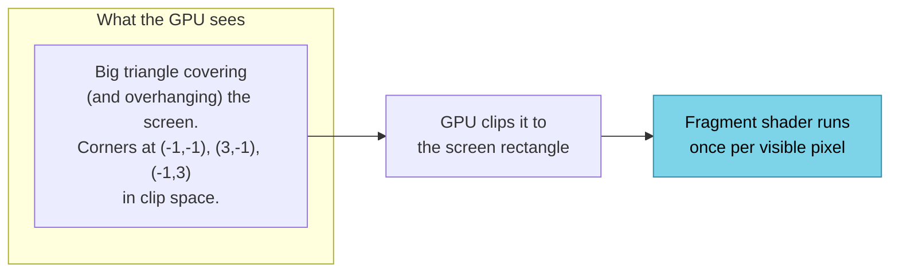

---

### 2. How vertex → fragment works

The GPU pipeline for drawing is two programmable stages with a fixed step between them:

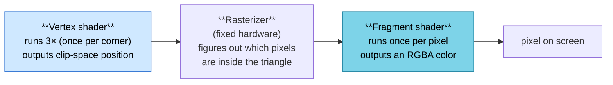

- The **vertex shader** runs 3 times and returns each corner's position in **clip space** (a coordinate system from -1 to +1).
- The **rasterizer** (built into the GPU, not programmable) interpolates between corners and decides which pixels the triangle covers.
- The **fragment shader** runs for each of those pixels and returns its color. *This is where, in later docs, we'll do all the raymarching.*

---

### 3. The WGSL

WGSL (WebGPU Shading Language) looks like a small, strict cousin of Rust. Here's the full-screen triangle shader with a simple gradient fragment stage:

```wgsl
// fullscreen.wgsl

// What the vertex stage passes to the fragment stage.
struct VertexOutput {
  @builtin(position) clip_pos: vec4f, // required: clip-space position
  @location(0) uv: vec2f,             // we pass screen UV (0..1) down to the fragment
};

// VERTEX STAGE — runs 3 times. No vertex buffer; we use the vertex index.
@vertex
fn vs_main(@builtin(vertex_index) idx: u32) -> VertexOutput {
  // Three points that form a triangle covering the screen.
  // pos goes from -1..3 so the triangle overhangs and fully covers -1..1.
  var positions = array<vec2f, 3>(
    vec2f(-1.0, -1.0),
    vec2f( 3.0, -1.0),
    vec2f(-1.0,  3.0),
  );
  let p = positions[idx];

  var out: VertexOutput;
  out.clip_pos = vec4f(p, 0.0, 1.0);
  // Map clip space (-1..1) to UV (0..1). Flip Y so (0,0) is top-left.
  out.uv = vec2f(p.x * 0.5 + 0.5, 1.0 - (p.y * 0.5 + 0.5));
  return out;
}

// FRAGMENT STAGE — runs once per pixel. Returns the pixel color.
@fragment
fn fs_main(in: VertexOutput) -> @location(0) vec4f {
  // Simple gradient: red increases left→right, green top→bottom.
  return vec4f(in.uv.x, in.uv.y, 0.3, 1.0);
}
```

A few WGSL notes for a TypeScript reader:

- `vec2f`, `vec3f`, `vec4f` are 2/3/4-component float vectors. `.x .y .z .w` access components; `.xy`, `.xz` etc. "swizzle" out sub-vectors.
- `@builtin(position)` and `@location(0)` are **annotations** telling the GPU what a value *is*. `@location(0)` on the fragment output means "write to the first (and only) color target."
- `array<vec2f, 3>(...)` is a fixed-size array literal.
- It's strongly typed and has **no garbage collector, no heap** — everything is value types.

---

### 4. Driving it: raw WebGPU vs TypeGPU

#### The raw WebGPU way (what's really happening)

```ts
// Compile the shader source into a module.
const module = device.createShaderModule({ code: fullscreenWgsl });

// Build a render pipeline: vertex stage + fragment stage + output format.
const pipeline = device.createRenderPipeline({
  layout: 'auto',
  vertex: { module, entryPoint: 'vs_main' },
  fragment: {
    module,
    entryPoint: 'fs_main',
    targets: [{ format }], // same format we configured the canvas with
  },
  primitive: { topology: 'triangle-list' },
});

function frame() {
  const encoder = device.createCommandEncoder();
  const pass = encoder.beginRenderPass({
    colorAttachments: [{
      view: context.getCurrentTexture().createView(),
      clearValue: { r: 0, g: 0, b: 0, a: 1 },
      loadOp: 'clear',
      storeOp: 'store',
    }],
  });
  pass.setPipeline(pipeline);
  pass.draw(3);          // draw 3 vertices = our one triangle
  pass.end();
  device.queue.submit([encoder.finish()]);
  context.present();
}
```

Note `pass.draw(3)` — three vertices, no vertex buffer. The vertex shader manufactures the positions from the index.

#### The TypeGPU way (typed, less error-prone)

TypeGPU wraps the same flow with a fluent, type-checked API. You build a "root" from the device, then describe the pipeline:

```ts
import tgpu from 'typegpu';

const root = tgpu.initFromDevice({ device });

// You can hand TypeGPU raw WGSL for the stages, or author them in TS.
const pipeline = root['~unstable']
  .withVertex(vsMain, {})          // vertex fn + (empty) vertex attributes
  .withFragment(fsMain, { format }) // fragment fn + output format
  .createPipeline();

function frame() {
  pipeline
    .withColorAttachment({
      view: context.getCurrentTexture().createView(),
      clearValue: [0, 0, 0, 1],
      loadOp: 'clear',
      storeOp: 'store',
    })
    .draw(3);

  root.flush();      // submit
  context.present();
}
```

> ⚠️ TypeGPU's exact pipeline API (the `withVertex`/`withFragment`/`createPipeline` chain, and whether it's under `'~unstable'`) moves between 0.x versions. Treat the snippet above as the *shape* and confirm against the current [TypeGPU pipelines docs](https://docs.swmansion.com/TypeGPU/fundamentals/pipelines/). The payoff is real: when our buffers get complex in [Doc 06](#doc-06), TypeGPU catches layout mistakes the raw API would let you ship as a black screen.

**Which do we use?** TypeGPU for the pipeline plumbing and typed data; raw WGSL strings for the parts of the shader we generate at runtime. Both interoperate.

---

### 5. Make it yours (sanity check)

Swap the fragment body to confirm you control every pixel. A couple of fun one-liners:

```wgsl
// Vignette circle in the middle of the screen:
@fragment
fn fs_main(in: VertexOutput) -> @location(0) vec4f {
  let d = distance(in.uv, vec2f(0.5, 0.5)); // 0 at center, ~0.7 at corners
  let c = smoothstep(0.4, 0.39, d);         // 1 inside a circle, 0 outside
  return vec4f(vec3f(c), 1.0);
}
```

If a white circle appears centered on screen, you've got full control of the fragment stage. **That circle is a 2D distance function** — `distance(uv, center)` is literally the SDF of a point. You just did SDF rendering in 2D without realizing it. In the next doc we extend the exact same idea to 3D.

---

### ✅ Checkpoint — you can now

- Explain the full-screen-triangle trick and why we don't need a vertex buffer.
- Describe the vertex → rasterizer → fragment flow.
- Read basic WGSL (vectors, swizzles, `@builtin`/`@location` annotations).
- Compile a shader, build a render pipeline, and `draw(3)` to paint every pixel — both raw and via TypeGPU.
- See the connection: a 2D `distance()` is already a tiny SDF.

**Next: [03 · Raymarching 101 »](#doc-03)**


<a id="doc-03"></a>

---

## 03 · Raymarching 101 — Draw a Sphere From Math

> **Goal:** Render a single, lit 3D sphere in your fragment shader using nothing but a distance formula. This is the technique the *entire* app is built on. Get this working and you've crossed the hardest conceptual hill.

This doc maps to a simplified version of the Rust files [`src/shaders/rendering.wgsl`](../../src/shaders/rendering.wgsl) (`ray_march`, `calc_normal`) and [`src/shaders/primitives.wgsl`](../../src/shaders/primitives.wgsl) (`sdf_sphere`).

---

### 1. SDFs in 3D

Recall from [Doc 00](#doc-00): a Signed Distance Function takes a 3D point and returns the distance to the nearest surface (negative inside, positive outside). The sphere is the simplest:

```wgsl
// Distance from point p to a sphere of radius r centered at origin.
fn sdf_sphere(p: vec3f, r: f32) -> f32 {
  return length(p) - r;
}
```

This is the *exact* function from the Rust app (it passes radius as `s.x`):

```wgsl
// src/shaders/primitives.wgsl
fn sdf_sphere(p: vec3f, s: vec3f) -> f32 {
    return length(p) - s.x;
}
```

A box is barely harder, and we'll want it soon, so here it is from the same file:

```wgsl
fn sdf_box(p: vec3f, s: vec3f) -> f32 {
    let q = abs(p) - s;                                  // s = half-extents
    return length(max(q, vec3f(0.0))) + min(max(q.x, max(q.y, q.z)), 0.0);
}
```

> 🧠 **You don't have to derive these.** Inigo Quilez maintains a famous catalog of SDF formulas at [iquilezles.org/articles/distfunctions](https://iquilezles.org/articles/distfunctions/). The Rust app's primitives come straight from there. You'll copy them; understanding the sphere is enough to trust the rest.

---

### 2. Sphere tracing — the core loop

We have a formula. How do we turn it into pixels? **For each pixel, shoot a ray and march it forward** until it hits the surface.

The genius of using an SDF: the distance value *is the safe step size*. If the nearest surface is 3 units away, you can leap 3 units forward with zero risk of tunneling through anything. As you approach a surface, the steps naturally shrink. When the distance is tiny (below a small threshold `EPSILON`), you've arrived.

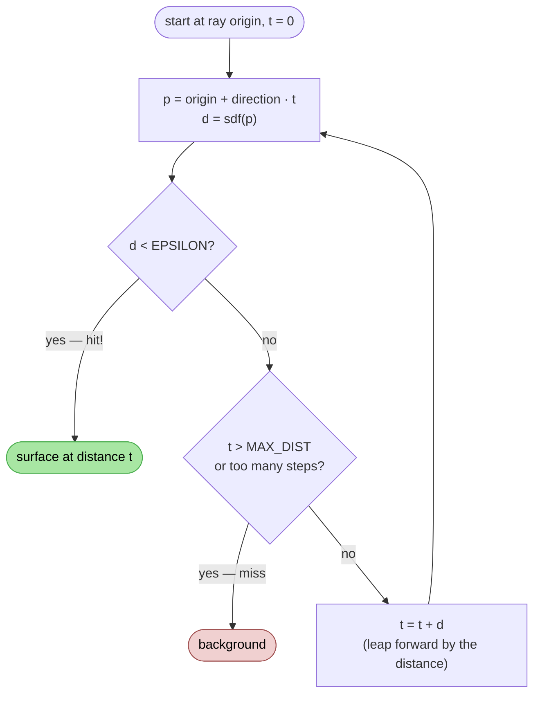

Here's a clean, beginner-readable version of the loop. (The Rust app's real loop adds speed tricks we'll mention at the end — but *this* is the heart of it.)

```wgsl
const MAX_STEPS: i32 = 96;
const MAX_DIST: f32 = 100.0;
const EPSILON: f32 = 0.001;

// Returns the distance traveled to the hit (or MAX_DIST+1 for a miss).
fn ray_march(origin: vec3f, dir: vec3f) -> f32 {
  var t = 0.0;
  for (var i = 0; i < MAX_STEPS; i++) {
    let p = origin + dir * t;   // current point along the ray
    let d = sdf_sphere(p, 1.0); // distance to the nearest surface
    if (d < EPSILON) {
      return t;                 // close enough — we hit the surface
    }
    t += d;                     // safe to leap forward by d
    if (t > MAX_DIST) { break; } // ray flew off into nothing
  }
  return MAX_DIST + 1.0;        // miss
}
```

> 🧠 **Why it's called *sphere* tracing:** at each point, the distance `d` defines an empty sphere around you that's guaranteed clear of geometry. You jump to its edge, draw a new sphere, jump again. Nothing to do with the sphere we're *drawing* — it's about the safe-radius spheres along the ray.

---

### 3. Generating camera rays

For each pixel we need a ray: an **origin** (the camera/eye position) and a **direction** (where that pixel points into the scene).

The standard way uses the **inverse view-projection matrix**. The view-projection matrix maps 3D world points onto the 2D screen; its inverse goes backward — from a screen pixel back out into the world. The Rust app stores exactly this (`inv_view_proj`) in its camera uniform and we'll do the same.

For *this* first sphere, you can hardcode a simple camera and skip matrices entirely:

```wgsl
@fragment
fn fs_main(in: VertexOutput) -> @location(0) vec4f {
  // uv is 0..1; remap to -1..1 and correct for aspect ratio.
  let p = (in.uv * 2.0 - 1.0) * vec2f(aspect, 1.0);

  // Hardcoded camera: sits at z = 3, looking toward -z.
  let origin = vec3f(0.0, 0.0, 3.0);
  let dir = normalize(vec3f(p.x, -p.y, -1.0)); // -1 on z = into the screen

  let t = ray_march(origin, dir);
  if (t > MAX_DIST) {
    return vec4f(0.1, 0.12, 0.15, 1.0);  // background
  }
  let hit = origin + dir * t;
  // ...shade it (next section)...
}
```

In [Doc 06](#doc-06) we'll replace this with a proper orbit camera fed by `inv_view_proj`, computed from a touch-driven camera. The Rust formula (from `pick.wgsl` / `rendering.wgsl`) is:

```wgsl
// Reconstruct a world-space ray from a pixel using the inverse view-projection.
let ndc = vec4f(uv.x * 2.0 - 1.0, -(uv.y * 2.0 - 1.0), 1.0, 1.0);
let world = camera.inv_view_proj * ndc;
let dir = normalize(world.xyz / world.w - camera.eye.xyz);
let origin = camera.eye.xyz;
```

---

### 4. Normals — which way does the surface face?

To light a surface you need its **normal** (the direction it faces). For a mesh, normals are stored per vertex. For an SDF, we *compute* the normal as the **gradient** of the distance field — the direction in which distance increases fastest points straight out of the surface.

The naive way samples the SDF 6 times (±x, ±y, ±z). The Rust app uses the cheaper **tetrahedron technique** (4 samples). Here it is, lifted from [`src/shaders/rendering.wgsl`](../../src/shaders/rendering.wgsl):

```wgsl
fn calc_normal(p: vec3f) -> vec3f {
  let e = 0.0005;             // a tiny offset
  let k = vec2f(1.0, -1.0);
  return normalize(
    k.xyy * sdf_sphere(p + k.xyy * e, 1.0) +
    k.yyx * sdf_sphere(p + k.yyx * e, 1.0) +
    k.yxy * sdf_sphere(p + k.yxy * e, 1.0) +
    k.xxx * sdf_sphere(p + k.xxx * e, 1.0)
  );
}
```

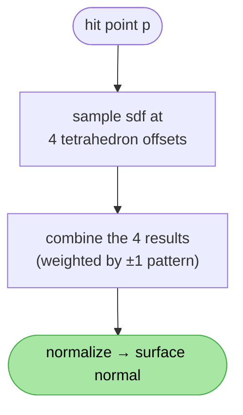

You don't need to understand *why* the `k.xyy` pattern works — it's a standard finite-difference trick. Just know: **4 cheap SDF samples → the surface normal.**

---

### 5. Basic lighting

With a hit point and a normal, the simplest believable shading is **diffuse (Lambert)**: brightness = how directly the surface faces the light.

```wgsl
// after computing `hit` and the normal:
let normal = calc_normal(hit);
let light_dir = normalize(vec3f(0.6, 0.8, 0.4));

let diffuse = max(dot(normal, light_dir), 0.0); // 1 facing light, 0 perpendicular
let ambient = 0.15;                              // so shadows aren't pure black
let lit = ambient + diffuse * 0.85;

let base_color = vec3f(0.9, 0.5, 0.3);
return vec4f(base_color * lit, 1.0);
```

If a shaded orange sphere appears on your phone — **you are now an SDF renderer.** Everything else in this app is "more shapes, combined, with a fancier version of this exact loop."

#### Soft shadows (a teaser)

Here's a beautiful SDF bonus you'll add later: to test if a point is in shadow, you raymarch *toward the light*. If you hit something, you're shadowed. But because the SDF tells you how *close* the ray passed to other geometry, you can get **soft, penumbra-style shadows for free** — the closer the shadow ray skims a surface, the darker the penumbra. The Rust app does this in its `soft_shadow` function (Inigo Quilez's method). We defer the details, but the takeaway: *shadows, ambient occlusion, and glow all fall out of "march another ray and see what the distance field tells you."*

---

### 6. The real loop's speed tricks (context, not required)

The beginner loop above is correct but not the fastest. The Rust `ray_march` ([rendering.wgsl:26](../../src/shaders/rendering.wgsl)) adds, in order of importance for mobile:

| Trick | What it does | Why it matters on a phone |
| --- | --- | --- |
| **AABB skip** | `ray_aabb` jumps the ray straight to the scene's bounding box, skipping all empty space before it | Huge: most pixels' rays start far from any shape |
| **Quality mode** | When the camera moves (`quality_mode > 0.5`), uses **half the steps** and a **4× coarser epsilon** | Keeps interaction smooth; full quality returns when still |
| **Over-relaxation** | Takes slightly *bigger* leaps (`× 1.2`) and backtracks if it overshoots | Fewer steps to converge on flat-ish surfaces |
| **Refinement** | Within a threshold of the surface, does 6 small binary-search steps | Crisp surfaces, especially for voxel sculpts |

```wgsl
// The shape of the real loop (simplified from rendering.wgsl):
let fast = camera.quality_mode > 0.5;
let eff_steps = select(MAX_STEPS, MAX_STEPS / 2, fast); // half steps when moving
let eps = select(EPSILON, EPSILON * 4.0, fast);          // coarser hit test when moving
// ... AABB skip to set starting t ...
// ... march with over-relaxation + refinement ...
```

> **For the rebuild:** start with the simple loop from §2. Add **AABB skip** and **quality mode** as soon as you have more than one shape — those two give the biggest mobile wins for the least complexity. Defer over-relaxation/refinement until you measure that you need them.

---

### ✅ Checkpoint — you can now

- Write `sdf_sphere` / `sdf_box` and trust the rest of IQ's catalog.
- Explain and implement the sphere-tracing loop (distance = safe step size).
- Generate a camera ray for a pixel (hardcoded now, `inv_view_proj` later).
- Compute a surface normal with the 4-sample tetrahedron trick.
- Shade a surface with diffuse + ambient lighting.
- Name the four loop speed-ups and which two to add first on mobile.

You can render *one* shape. Next: how do we describe a whole scene of *many* shapes as data?

**Next: [04 · The Scene Data Model »](#doc-04)**


<a id="doc-04"></a>

---

## 04 · The Scene Data Model

> **Goal:** Represent a *whole scene* — many shapes, combined and transformed — as clean TypeScript data. This data structure is the single source of truth that everything else reads from. No GPU here; this is pure data design.

Maps to the Rust file [`src/graph/scene.rs`](../../src/graph/scene.rs).

---

### 1. The big idea: a scene is a tree

In [Doc 03](#doc-03) we hardcoded one sphere. Real scenes are built by **combining** shapes. "A sphere smooth-unioned with a box, then the whole thing twisted" is naturally a **tree**:

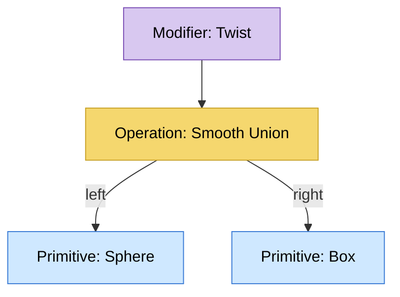

- **Leaves** are **primitives** (sphere, box, …) — actual shapes.
- **Branches** are **operations** (union, subtract, …) that combine two children, or **modifiers/transforms** that take one child and bend/move/twist it.
- The **root** is the final combined shape that gets drawn.

> 🧠 The Rust app stores this as a `HashMap<NodeId, SceneNode>` where each node holds the *IDs* of its children (not the children directly). This is a flat map with explicit links — easier to mutate, serialize, and look up than nested objects. We do the same with a JS `Map`.

---

### 2. The core types in TypeScript

Here's the data model, trimmed to a beginner-friendly **core set** (the Rust app has more — see the "defer" callout). A node is one of several *kinds*, so we use a **discriminated union** (TypeScript's equivalent of the Rust `enum NodeData`).

```ts
// scene.ts

export type NodeId = number;

// A 3-component vector. (We use a plain tuple; mirrors Rust's Vec3.)
export type Vec3 = [number, number, number];

// ---- Leaf shapes ----
export type PrimitiveKind =
  | 'sphere' | 'box' | 'cylinder' | 'torus' | 'plane'; // core 5; more later

// ---- Ways to combine two shapes ----
export type CsgOp =
  | 'union' | 'subtract' | 'intersect'
  | 'smoothUnion' | 'smoothSubtract' | 'smoothIntersect'; // core 6; more later

// ---- Ways to deform one shape ----
export type ModifierKind =
  | 'twist' | 'bend' | 'round' | 'mirror' | 'repeat'; // core 5; more later

// ---- Surface appearance (PBR core; advanced lobes deferred) ----
export interface Material {
  baseColor: Vec3;
  metallic: number;   // 0 = plastic/dielectric, 1 = metal
  roughness: number;  // 0 = mirror, 1 = matte
  emissive: Vec3;     // glow color
  emissiveIntensity: number;
}

// ---- The node "kind" union ----
export type NodeData =
  | { type: 'primitive'; kind: PrimitiveKind; position: Vec3; rotation: Vec3; scale: Vec3; material: Material }
  | { type: 'operation'; op: CsgOp; smoothK: number; left: NodeId | null; right: NodeId | null }
  | { type: 'transform'; input: NodeId | null; translation: Vec3; rotation: Vec3; scale: Vec3 }
  | { type: 'modifier'; kind: ModifierKind; input: NodeId | null; value: Vec3; extra: Vec3 }
  | { type: 'sculpt'; input: NodeId | null; position: Vec3; rotation: Vec3; material: Material; voxelGrid: VoxelGrid }
  | { type: 'light'; lightType: 'point' | 'directional' | 'spot'; color: Vec3; intensity: number };

// ---- A node = id + name + its data ----
export interface SceneNode {
  id: NodeId;
  name: string;
  locked: boolean;
  data: NodeData;
}

// ---- The whole scene ----
export interface Scene {
  nodes: Map<NodeId, SceneNode>;
  nextId: NodeId;
  hiddenNodes: Set<NodeId>;
  structureVersion: number; // bumps when the TREE SHAPE changes
  dataVersion: number;      // bumps when only NUMBERS change
}
```

`VoxelGrid` belongs to sculpting — we'll define it in [Doc 08](#doc-08). For now treat it as a placeholder.

#### How this maps to the Rust source

| TypeScript | Rust (`scene.rs`) |
| --- | --- |
| `type NodeId = number` | `pub type NodeId = u64` |
| `NodeData` discriminated union | `enum NodeData { Primitive {...}, Operation {...}, ... }` |
| `Map<NodeId, SceneNode>` | `HashMap<NodeId, SceneNode>` |
| `null` for missing child | `Option<NodeId>` (`None`) |
| `structureVersion` / `dataVersion` | `structure_version` / `data_version` |

This is the classic **Rust enum → TypeScript discriminated union** translation. `switch (node.data.type)` in TS plays the role of Rust's `match`.

---

### 3. The node taxonomy

Every node is one of these six kinds. Memorize the *shape* of this and the app makes sense:

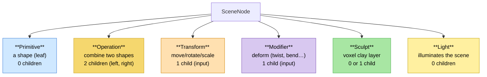

| Kind | Children | Role |
| --- | --- | --- |
| Primitive | 0 | A base shape with position/rotation/scale + material |
| Operation | 2 (`left`, `right`) | CSG: union/subtract/intersect, optionally smooth |
| Transform | 1 (`input`) | Position/rotate/scale a subtree |
| Modifier | 1 (`input`) | Deform a subtree (twist/bend/round/…) |
| Sculpt | 0 or 1 | Voxel-grid clay. With a child = "displacement on top of that shape"; without = standalone clay |
| Light | 0 | A light source |

---

### 4. The two-speed versions (this matters)

Remember the two-speed insight from [Doc 00](#doc-00)? It lives in the data model as two numbers the scene tracks.

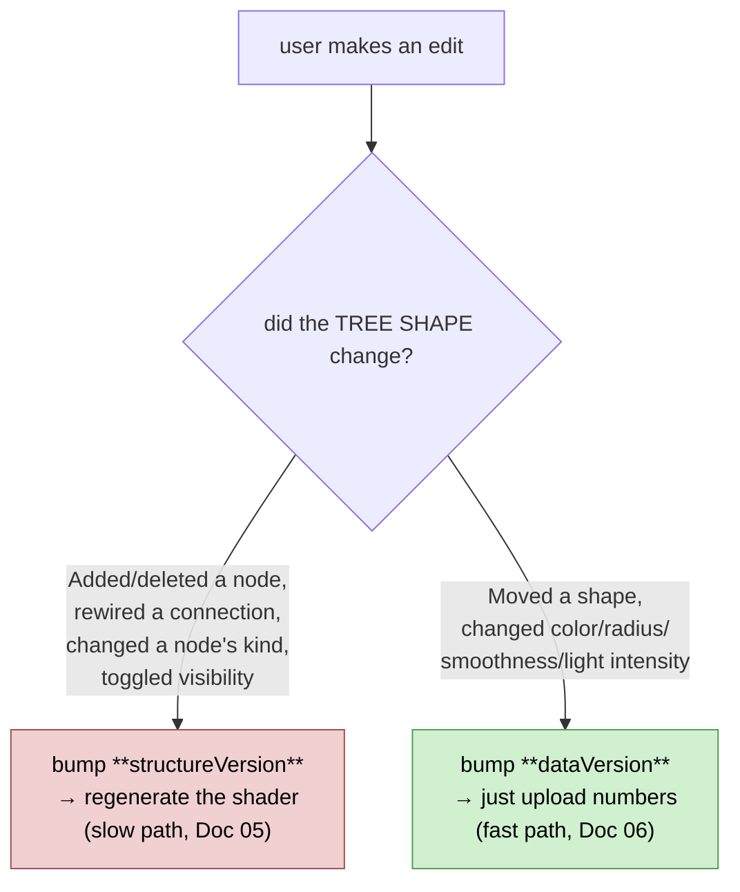

The Rust app computes these as O(n) hashes of the relevant fields (`structure_key()` and `data_fingerprint()`), but for the rebuild a simpler and equally correct approach is: **whichever function mutates the scene bumps the right counter.** Helpers make this hard to forget:

```ts
// Structural edit — changes the tree's shape. Triggers a shader rebuild.
function markStructureChanged(scene: Scene) {
  scene.structureVersion++;
  scene.dataVersion++;        // structure changes also imply data changed
}

// Data edit — only numbers changed. Triggers a cheap buffer upload.
function markDataChanged(scene: Scene) {
  scene.dataVersion++;
}

// Example: adding a node is structural.
function addPrimitive(scene: Scene, kind: PrimitiveKind): NodeId {
  const id = scene.nextId++;
  scene.nodes.set(id, {
    id, name: `${kind} ${id}`, locked: false,
    data: { type: 'primitive', kind, position: [0,0,0], rotation: [0,0,0], scale: [1,1,1], material: defaultMaterial() },
  });
  markStructureChanged(scene);
  return id;
}

// Example: dragging it is data-only.
function setPosition(scene: Scene, id: NodeId, pos: Vec3) {
  const node = scene.nodes.get(id);
  if (node?.data.type === 'primitive') {
    node.data.position = pos;
    markDataChanged(scene);
  }
}
```

> Why the discipline pays off: a user dragging a slider fires `setPosition` 60×/second. If each one triggered a shader recompile, the app would freeze. Routing it through `markDataChanged` keeps it buttery. **This single distinction is the difference between a responsive app and an unusable one.**

---

### 5. Traversal: post-order

When we generate the shader ([Doc 05](#doc-05)) we must visit children **before** their parents — you can't combine two shapes until both exist. That's a **post-order traversal**. The Rust app calls this `visible_topo_order()` (it also skips hidden nodes).

```ts
// Visit children before parents; skip hidden subtrees.
function visibleTopoOrder(scene: Scene): NodeId[] {
  const out: NodeId[] = [];
  const visit = (id: NodeId | null) => {
    if (id == null || scene.hiddenNodes.has(id)) return;
    const node = scene.nodes.get(id);
    if (!node) return;
    // Recurse into children FIRST.
    switch (node.data.type) {
      case 'operation': visit(node.data.left); visit(node.data.right); break;
      case 'transform':
      case 'modifier':
      case 'sculpt':    visit(node.data.input); break;
    }
    out.push(id); // ...then record this node.
  };
  for (const root of topLevelNodes(scene)) visit(root);
  return out;
}
```

For the tree in §1 (`Twist → Union → {Sphere, Box}`), post-order gives: **`[Sphere, Box, Union, Twist]`**. Children always come before the parent that uses them. Hold onto that order — it's literally the order we'll emit shader code in next.

---

### 6. "Core now / defer later" 📦

We trimmed aggressively. Here's exactly what we cut and where it returns:

| Deferred | Rust has | Add when |
| --- | --- | --- |
| Primitives: cone, capsule, ellipsoid, hex prism, pyramid | 10 total | After the core 5 render |
| CSG: chamfer, stairs, columns | 13 total | Once smooth ops work |
| Modifiers: taper, elongate, onion, offset, finite/radial repeat, noise | 12 total | Incrementally |
| Material lobes: clearcoat, sheen, transmission, anisotropy, IOR | 13-field GPU material | When you want photoreal looks |
| Light: range, spot angle, shadows, cookies, arrays, expressions | rich `Light` struct | When lighting becomes a focus |

Starting small is not laziness — it's how you get pixels on screen this week instead of next month. Every deferred item slots into the *same* tree structure later.

---

### ✅ Checkpoint — you can now

- Model a scene as a `Map<NodeId, SceneNode>` tree with a discriminated-union `NodeData`.
- Translate Rust `enum`/`HashMap`/`Option` into TS unions/`Map`/`null`.
- Identify the six node kinds and how many children each has.
- Explain and implement `structureVersion` vs `dataVersion` and route edits to the right one.
- Produce a post-order (`visibleTopoOrder`) traversal of the tree.

You have data. Now the magic trick: turning that data into a running GPU shader.

**Next: [05 · Runtime Codegen ⭐ »](#doc-05)**


<a id="doc-05"></a>

---

## 05 · Runtime Codegen — Turn Scene Data Into a Shader ⭐

> **Goal:** Take the scene tree from [Doc 04](#doc-04) and **automatically write a WGSL `scene_sdf()` function** from it, at runtime. This is the single most important technique in the app. Understand this doc and you understand the whole engine.

Maps to [`src/gpu/codegen.rs`](../../src/gpu/codegen.rs) and [`src/gpu/shader_templates.rs`](../../src/gpu/shader_templates.rs).

---

### 1. Why generate code at all?

The raymarch loop ([Doc 03](#doc-03)) calls one function: `scene_sdf(p)` — "what's the distance to the scene at point `p`?" For a single hardcoded sphere that's trivial. But the user's scene is *arbitrary* data: any number of shapes, combined any way, nested any depth.

You have two options to evaluate an arbitrary tree on the GPU:

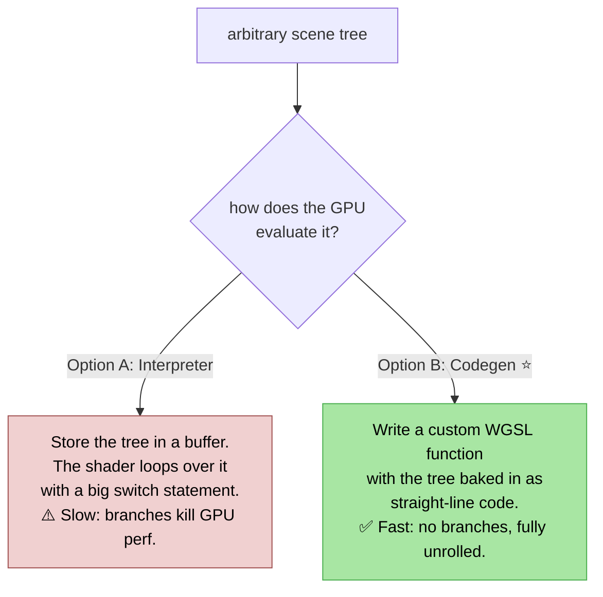

**Codegen wins** because GPUs hate branching. A generated function like `let n2 = op_union(n0, n1, 0.0);` is branch-free, straight-line code the GPU compiler can optimize hard. The cost is that you must **recompile the shader whenever the tree's shape changes** — which is exactly the `structureVersion` slow path we built for. (The Rust app actually keeps a slower interpreter — its "tape" — as a *fallback* while the fast generated shader compiles in the background. We'll mention that, but you can skip it for v1.)

---

### 2. The core algorithm: tree → straight-line code

The recipe, in three steps:

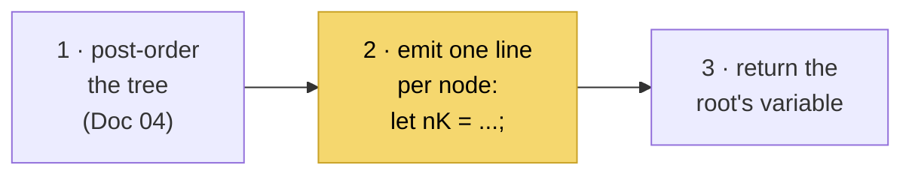

Each node in post-order becomes **one local variable** `n0, n1, n2, …` where the number is the node's position in the traversal. Because it's post-order, a node's children already have variables by the time we emit the node. The Rust app does exactly this — `generate_scene_sdf` builds an index map `order.iter().enumerate()` and emits `let n{i} = ...`.

#### The value every node produces: `vec4f`

Each `nK` is not just a distance — it's a `vec4f` packing four things, a convention used throughout the Rust shaders:

```
vec4f(distance, materialA, materialB, blend)
        │          │          │         └─ 0 = pure A, 1 = pure B (for smooth blends)
        │          │          └─ secondary material id (-1 if none)
        │          └─ primary material id (= the node's index)
        └─ signed distance to surface
```

Why carry material IDs through the distance field? So that when two shapes smoothly blend, the renderer can **blend their colors** too, not just their geometry. The "material id" is simply the node's index — the renderer looks up that node's color in the node buffer ([Doc 06](#doc-06)).

---

### 3. A worked example

Take the tree `Union(Sphere, Box)`. Post-order is `[Sphere, Box, Union]` → indices `n0, n1, n2`.

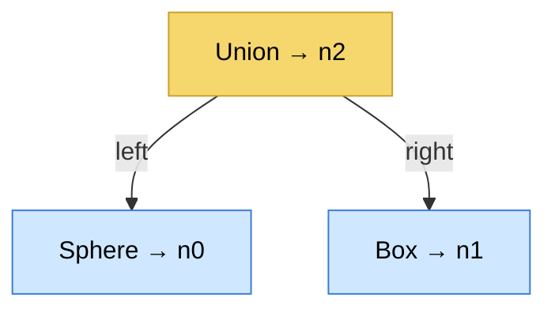

The generated function:

```wgsl
fn scene_sdf(p: vec3f) -> vec4f {
  // n0: Sphere (node 0). Move p into the sphere's local space, then evaluate.
  let lp0 = rotate_euler(p - nodes[0].position.xyz, nodes[0].rotation.xyz);
  let n0 = vec4f(sdf_sphere(lp0, nodes[0].scale.xyz), 0.0, -1.0, 0.0);

  // n1: Box (node 1).
  let lp1 = rotate_euler(p - nodes[1].position.xyz, nodes[1].rotation.xyz);
  let n1 = vec4f(sdf_box(lp1, nodes[1].scale.xyz), 1.0, -1.0, 0.0);

  // n2: Union of n0 and n1.
  let n2 = op_union(n0, n1, 0.0);

  return n2;
}
```

Notice:
- `nodes[K]` is the **node data buffer** — the per-node numbers (position, scale, color…) uploaded from the scene. The *shape* of the function is baked in; the *numbers* come from the buffer. **This is what makes the two-speed sync possible**: move the sphere, and only `nodes[0].position` changes — same function, just re-upload the buffer.
- The material id is the literal node index (`0.0`, `1.0`); `-1.0` means "no second material."
- Primitives first transform `p` into local space (`p - position`, then inverse rotation) before calling the SDF — that's how a shape gets positioned/oriented.

---

### 4. Writing the generator in TypeScript

Here's a real, runnable generator for the core node kinds. It mirrors the Rust `emit_node_wgsl` + `generate_scene_sdf_flat`.

```ts
// codegen.ts
import { Scene, NodeId, visibleTopoOrder, topLevelNodes } from './scene';

export function generateSceneSdf(scene: Scene): string {
  const order = visibleTopoOrder(scene);
  if (order.length === 0) {
    return `fn scene_sdf(p: vec3f) -> vec4f { return vec4f(1e10, -1.0, -1.0, 0.0); }`;
  }

  // node id -> its variable index (n0, n1, ...)
  const idx = new Map<NodeId, number>();
  order.forEach((id, i) => idx.set(id, i));

  const lines: string[] = ['fn scene_sdf(p: vec3f) -> vec4f {'];

  order.forEach((id, i) => {
    const node = scene.nodes.get(id)!;
    const d = node.data;
    switch (d.type) {
      case 'primitive': {
        const fn = primitiveFn(d.kind);            // 'sdf_sphere', 'sdf_box', ...
        lines.push(`  let lp${i} = rotate_euler(p - nodes[${i}].position.xyz, nodes[${i}].rotation.xyz);`);
        lines.push(`  let n${i} = vec4f(${fn}(lp${i}, nodes[${i}].scale.xyz), f32(${i}), -1.0, 0.0);`);
        break;
      }
      case 'operation': {
        const a = idx.get(d.left!)!;
        const b = idx.get(d.right!)!;
        const fn = opFn(d.op);                      // 'op_union', 'op_smooth_union', ...
        // smooth ops take the smoothness k from the node buffer (type_op.y).
        const k = `nodes[${i}].type_op.y`;
        lines.push(`  let n${i} = ${fn}(n${a}, n${b}, ${k});`);
        break;
      }
      case 'modifier': {
        const c = idx.get(d.input!)!;
        // Distance modifiers tweak the child's distance; point modifiers are
        // handled by transforming p (see §5). 'round' shown here:
        if (d.kind === 'round') {
          lines.push(`  let n${i} = vec4f(n${c}.x - nodes[${i}].value.x, n${c}.yzw);`);
        } else {
          lines.push(`  let n${i} = n${c}; // point modifier handled in transform chain`);
        }
        break;
      }
      // transform / sculpt / light handled similarly...
    }
  });

  // Fold all top-level nodes together with a hard union (matches Rust).
  const tops = topLevelNodes(scene).map((id) => idx.get(id)!);
  if (tops.length === 1) {
    lines.push(`  return n${tops[0]};`);
  } else {
    lines.push(`  var result = n${tops[0]};`);
    tops.slice(1).forEach((t) => lines.push(`  result = op_union(result, n${t}, 0.0);`));
    lines.push(`  return result;`);
  }

  lines.push('}');
  return lines.join('\n');
}
```

> 🐛 **A real bug this codebase hit** (recorded in the project's memory): if you forget to **fold the top-level nodes together** at the end, any scene with more than one root shape silently loses all but the first. The `op_union(result, n{t}, 0.0)` loop above is that fold — don't skip it. The Rust app learned this the hard way; we get it for free by reading this note.

---

### 5. The harder bits (so you're not surprised)

The example above is the friendly 80%. The Rust `codegen.rs` handles three things you'll grow into:

#### a) Transform chains (positioning subtrees)

A `Transform` or *point* modifier (twist, bend) doesn't change distance — it changes the **input point** `p` before the child evaluates. The Rust app walks up the ancestor chain and applies the inverse transforms **outermost-first**, so a sphere inside a twisted, moved group gets `p` warped correctly:

```wgsl
let lp0 = rotate_euler(p - nodes[0].position.xyz, nodes[0].rotation.xyz); // the transform
let tp0_0 = twist_point(lp0, nodes[1].value.x);                           // then the twist
let n0 = vec4f(sdf_sphere(tp0_0, nodes[0].scale.xyz), f32(0), -1.0, 0.0);
```

> Mental model: **distance modifiers** (round, onion, offset) edit the child's *output distance*; **point modifiers** (twist, bend, mirror, repeat) edit the *input coordinate*. Codegen routes each to the right place.

#### b) Operations need a shader library

`op_union`, `op_smooth_union`, `sdf_sphere`, `rotate_euler`, `twist_point` … these aren't generated — they're **static WGSL** you write once and prepend. The Rust app keeps them in separate files (`operations.wgsl`, `primitives.wgsl`, `transforms.wgsl`, `modifiers.wgsl`) and concatenates. Here are two real ones from [`operations.wgsl`](../../src/shaders/operations.wgsl):

```wgsl
fn op_union(a: vec4f, b: vec4f, k: f32) -> vec4f {
    if (a.x < b.x) { return a; } else { return b; }  // closer surface wins
}

fn op_smooth_union(a: vec4f, b: vec4f, k: f32, color_k: f32) -> vec4f {
    let h = clamp(0.5 + 0.5 * (b.x - a.x) / max(k, 0.0001), 0.0, 1.0);
    let d = mix(b.x, a.x, h) - k * h * (1.0 - h);     // the smooth blend
    return vec4f(d, a.y, b.y, 1.0 - h);               // blend materials too
}
```

#### c) Sculpt bounding optimization (skip for v1)

When the scene contains a voxel sculpt (expensive to sample), the Rust app splits codegen into two phases: cheap analytical shapes evaluated always, expensive sculpt subtrees wrapped in `if (bounding_sphere_distance < result.x) { ... }` so the GPU only samples the voxel texture when the ray is actually near it. Pure performance; add it in [Doc 08](#doc-08) once sculpting works.

---

### 6. Assembling the full shader

The generated `scene_sdf` is the filling in a sandwich:

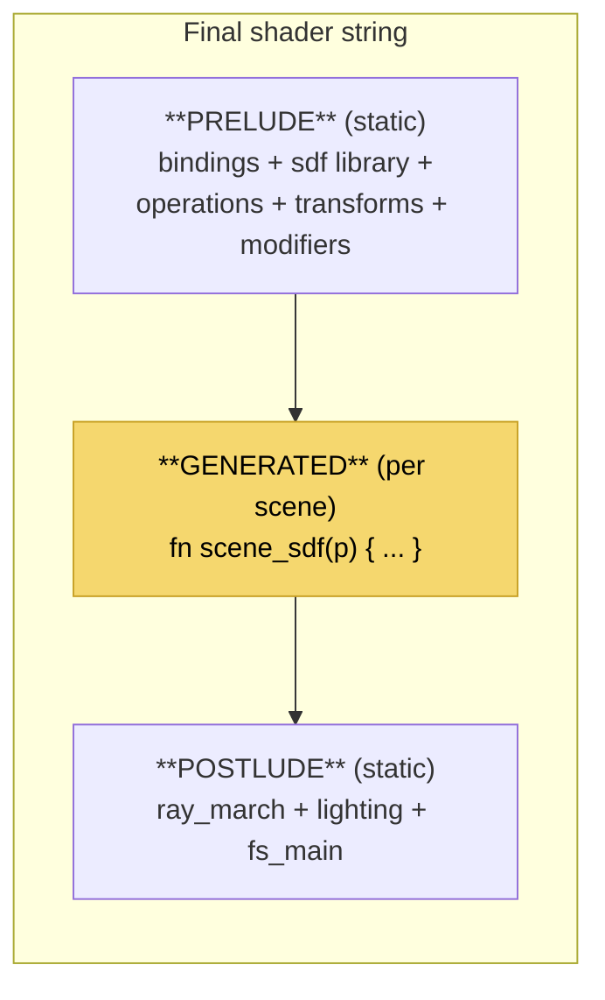

```ts
function buildRenderShader(scene: Scene, config: RenderConfig): string {
  return [
    PRELUDE,                       // bindings + all static SDF/op/transform fns
    generateSceneSdf(scene),       // the dynamic part
    applyConfig(POSTLUDE, config), // ray_march + lighting, with config values substituted
  ].join('\n');
}
```

The Rust app's `shader_templates.rs` does this assembly, and also does a neat trick: the postlude has placeholders like `/*MARCH_MAX_STEPS*/` that get string-replaced with values from the render settings (so changing quality doesn't require editing WGSL by hand). You can copy that pattern verbatim — it's just `.replace()`.

> **The hybrid, concretely:** `PRELUDE`/`POSTLUDE` are fixed WGSL you can manage with **TypeGPU** (typed bindings, validated layouts). `generateSceneSdf` is a **runtime string** because it's data-driven. They concatenate into one shader module. Best of both worlds.

---

### 7. When (and how) to recompile

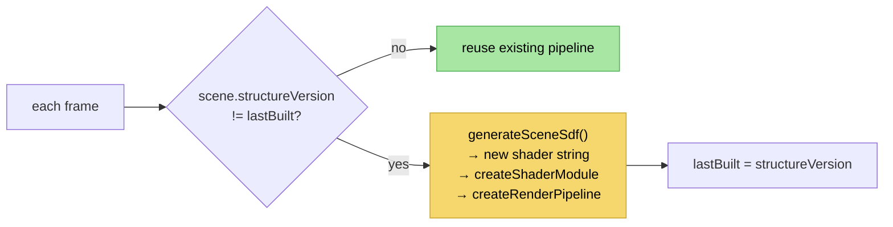

Compiling a pipeline takes a few to tens of milliseconds, so you do it **only on structural change**, never per frame. On a phone this matters even more. Two refinements (defer until needed):

1. **Compile async / off the hot path** so a structural edit doesn't stutter the frame. (`device.createRenderPipelineAsync`.)
2. **Keep rendering the old pipeline** until the new one is ready — the Rust app even keeps an interpreter "tape" fallback. For v1, a brief hitch on structural edits is fine; optimize when you feel it.

---

### ✅ Checkpoint — you can now

- Explain why codegen beats a GPU-side interpreter (no branches → fast).
- Post-order the tree and emit one `let nK = …;` per node.
- Read and produce the `vec4f(distance, matA, matB, blend)` convention.
- Write a TS generator for primitives + operations, folding multiple roots with `op_union`.
- Distinguish distance modifiers (edit output) from point modifiers (edit input `p`).
- Assemble PRELUDE + generated `scene_sdf` + POSTLUDE into one shader.
- Recompile only when `structureVersion` changes.

This is the summit. From here it's wiring: feeding numbers in and getting touch out.

**Next: [06 · Buffers, Camera & the Render Loop »](#doc-06)**


<a id="doc-06"></a>

---

## 06 · Buffers, Camera & the Render Loop

> **Goal:** Feed the scene's *numbers* to the GPU through typed buffers, build a touch-driven orbit camera, and wire the per-frame loop together with a state store — including the two-speed sync that keeps it all fast. After this, you can fly around a live scene with your fingers.

Maps to [`src/gpu/buffers.rs`](../../src/gpu/buffers.rs), [`src/gpu/camera.rs`](../../src/gpu/camera.rs), [`src/app/gpu_sync.rs`](../../src/app/gpu_sync.rs), [`src/app/state.rs`](../../src/app/state.rs), [`src/app/actions.rs`](../../src/app/actions.rs).

---

### 1. The node data buffer

In [Doc 05](#doc-05) the generated shader read `nodes[0].position`, `nodes[1].scale`, etc. That `nodes` array is a **storage buffer** we upload each time data changes. Every node becomes a fixed-size record.

The Rust app uses a 208-byte record (`SdfNodeGpu`, 13 × `vec4f`) packed with everything a node might need ([buffers.rs:9](../../src/gpu/buffers.rs)). For the rebuild we use a **trimmed record** — just the core fields — and grow it later:

```ts
// gpu-layout.ts — define the layout ONCE with TypeGPU; it computes byte offsets.
import * as d from 'typegpu/data';

export const SdfNode = d.struct({
  typeOp:   d.vec4f, // [typeId, smoothK, metallic, roughness]
  position: d.vec4f, // [x, y, z, _]
  rotation: d.vec4f, // [rx, ry, rz, _] (radians)
  scale:    d.vec4f, // [sx, sy, sz, _]
  color:    d.vec4f, // [r, g, b, isSelected]
  // (Rust packs 8 more vec4f for advanced materials/sculpt — add later.)
});

// A whole scene = a runtime-sized array of these.
export const SdfNodeArray = (count: number) => d.arrayOf(SdfNode, count);
```

> 💡 This is exactly why we use TypeGPU. In raw WebGPU you'd hand-compute byte offsets and `Float32Array` strides, and a single mistake = silent black screen. TypeGPU derives the layout from the struct and type-checks your writes.

The matching WGSL struct (part of your static PRELUDE) mirrors it field-for-field:

```wgsl
struct SdfNode {
  type_op:  vec4f,
  position: vec4f,
  rotation: vec4f,
  scale:    vec4f,
  color:    vec4f,
};
@group(1) @binding(0) var<storage, read> nodes: array<SdfNode>;
```

#### Building the buffer from the scene

Walk the scene in the **same `visibleTopoOrder`** used by codegen — so `nodes[i]` lines up with the generated `n{i}`. (This ordering contract between codegen and buffer-build is critical; the Rust app guarantees it by calling `visible_topo_order()` in both.)

```ts
function buildNodeData(scene: Scene, selected: Set<NodeId>): Float32Array {
  const order = visibleTopoOrder(scene);
  const FLOATS_PER_NODE = 5 * 4; // 5 vec4f in our trimmed layout
  const out = new Float32Array(order.length * FLOATS_PER_NODE);

  order.forEach((id, i) => {
    const n = scene.nodes.get(id)!;
    const base = i * FLOATS_PER_NODE;
    if (n.data.type === 'primitive') {
      const m = n.data.material;
      out.set([primitiveTypeId(n.data.kind), 0, m.metallic, m.roughness], base + 0);   // typeOp
      out.set([...n.data.position, 0], base + 4);                                       // position
      out.set([...n.data.rotation, 0], base + 8);                                       // rotation
      out.set([...n.data.scale, 0], base + 12);                                         // scale
      out.set([...m.baseColor, selected.has(id) ? 1 : 0], base + 16);                   // color
    }
    // operation/modifier/etc. pack their own fields (smoothK in typeOp.y, ...)
  });
  return out;
}
```

---

### 2. Uniform vs storage buffers

Two buffer kinds, two jobs:

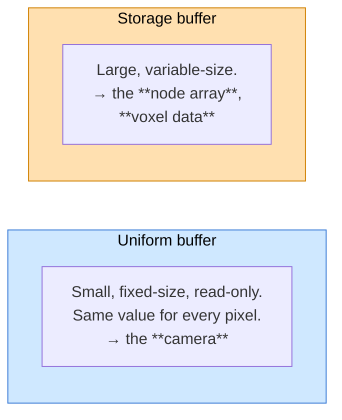

The **camera uniform** carries everything the shader needs to make rays and light the scene. The Rust `CameraUniform` is big (lights, environment, etc.); our core version:

```wgsl
struct Camera {
  inv_view_proj: mat4x4f, // pixel → world ray (Doc 03)
  eye: vec4f,             // camera position
  viewport: vec4f,        // [x, y, width, height]
  scene_min: vec4f,       // AABB min (for the empty-space skip)
  scene_max: vec4f,       // AABB max
  quality_mode: f32,      // >0.5 while moving → fewer march steps
};
@group(0) @binding(0) var<uniform> camera: Camera;
```

These map to **bind groups** (from [Doc 01](#doc-01)): camera at `@group(0)`, nodes at `@group(1)`. (Voxel textures will take `@group(2)` in [Doc 08](#doc-08).)

---

### 3. The orbit camera

The Rust camera ([camera.rs](../../src/gpu/camera.rs)) is an **orbit camera**: it circles a target point. Its state is small and clean — port it directly.

```ts
// camera.ts
export interface Camera {
  yaw: number;     // horizontal angle (radians)
  pitch: number;   // vertical angle
  distance: number;// how far from target (zoom)
  target: Vec3;    // the point we orbit around
  fov: number;     // field of view (radians)
}

// Eye position = target + offset computed from the two angles + distance.
export function eyePosition(c: Camera): Vec3 {
  const x = c.distance * Math.cos(c.yaw) * Math.cos(c.pitch);
  const y = c.distance * Math.sin(c.pitch);
  const z = c.distance * Math.sin(c.yaw) * Math.cos(c.pitch);
  return [c.target[0] + x, c.target[1] + y, c.target[2] + z];
}
```

To produce `inv_view_proj`, build a view matrix (`lookAt(eye, target, up)`) and a perspective matrix, multiply, invert. Use a small matrix library — **`wgpu-matrix`** is the standard pairing with WebGPU and works on RN:

```ts
import { mat4, vec3 } from 'wgpu-matrix';

function cameraUniform(c: Camera, width: number, height: number, qualityMode: number) {
  const eye = eyePosition(c);
  const view = mat4.lookAt(eye, c.target, [0, 1, 0]);
  const proj = mat4.perspective(c.fov, width / height, 0.01, 100);
  const viewProj = mat4.multiply(proj, view);
  const invViewProj = mat4.inverse(viewProj);
  return { invViewProj, eye, viewport: [0, 0, width, height], qualityMode };
}
```

#### Touch controls with gesture-handler

Mouse → touch is the biggest interaction change from desktop. Map the natural gestures:

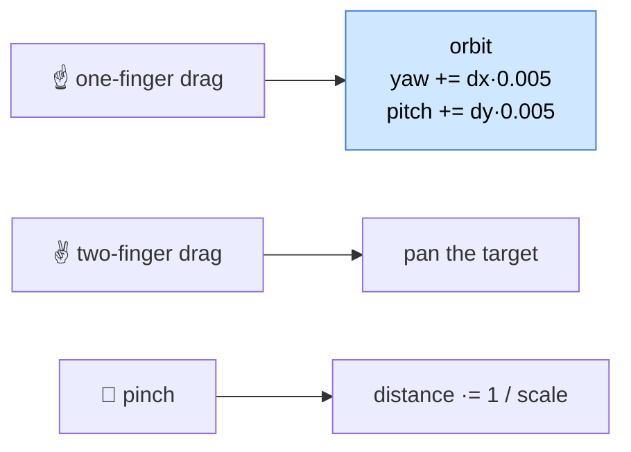

```tsx
import { Gesture, GestureDetector } from 'react-native-gesture-handler';

const orbit = Gesture.Pan()
  .maxPointers(1)
  .onChange((e) => {
    camera.yaw   += e.changeX * 0.005;
    camera.pitch += e.changeY * 0.005;
    camera.pitch  = clamp(camera.pitch, -1.5, 1.5); // don't flip over the poles
    setCameraMoving(true); // → quality_mode on (see §5)
  })
  .onEnd(() => setCameraMoving(false));

const zoom = Gesture.Pinch().onChange((e) => {
  camera.distance = clamp(camera.distance / e.scaleChange, 0.5, 50);
  setCameraMoving(true);
});

// In JSX: wrap the Canvas
// <GestureDetector gesture={Gesture.Simultaneous(orbit, zoom)}><Canvas .../></GestureDetector>
```

> The Rust values (`yaw += dx * 0.005`, `distance *= 1 - delta*0.001`) port directly — touch deltas just replace mouse deltas.

---

### 4. State: the store as the "one mutation point"

The Rust app funnels *every* structural edit through one place: an `Action` enum processed by `process_actions()` (a Redux-style reducer — "the single mutation gate"). This is great architecture and we keep it. In React, a **Zustand store** plays that role.

```mermaid
flowchart LR
    UI["React panels<br/>(buttons, sliders)"] -->|"dispatch action"| Store["Zustand store<br/>(the ONE mutation point)"]
    Gesture["touch gestures"] -->|"camera updates"| Store
    Store -->|"reads scene + versions"| Engine["GPU engine<br/>(imperative)"]
    Engine -->|"renders"| Canvas["Canvas"]
    style Store fill:#d8c8f0,stroke:#7b4fb5,color:#000
```

```ts
// store.ts
import { create } from 'zustand';

interface AppState {
  scene: Scene;
  camera: Camera;
  selected: Set<NodeId>;
  // actions = the only way to mutate the scene
  addPrimitive: (kind: PrimitiveKind) => void;
  setPosition: (id: NodeId, pos: Vec3) => void;
  select: (id: NodeId | null) => void;
}

export const useStore = create<AppState>((set, get) => ({
  scene: emptyScene(),
  camera: defaultCamera(),
  selected: new Set(),

  // structural → bumps structureVersion inside addPrimitive (Doc 04)
  addPrimitive: (kind) => set((s) => { addPrimitive(s.scene, kind); return { scene: { ...s.scene } }; }),

  // data-only → bumps dataVersion
  setPosition: (id, pos) => set((s) => { setPosition(s.scene, id, pos); return { scene: { ...s.scene } }; }),

  select: (id) => set((s) => ({ selected: id == null ? new Set() : new Set([id]) })),
}));
```

> ✅ Good practice: UI components **never** mutate `scene` directly. They call store actions, exactly like UI in the Rust app emits `Action` values instead of touching the `Scene`. One mutation path = predictable app, easy undo ([Doc 09](#doc-09)).

---

### 5. The frame loop + two-speed sync

Now the payoff. Each frame the engine compares versions and does the *minimum* work. This is the heart of `gpu_sync.rs` translated.

```mermaid
flowchart TD
    Frame(["new frame"]) --> SV{"structureVersion<br/>changed?"}
    SV -->|yes| Rebuild["regenerate scene_sdf<br/>+ recompile pipeline<br/>(slow, rare)"]
    SV -->|no| DV
    Rebuild --> DV{"dataVersion<br/>changed?"}
    DV -->|yes| Upload["rebuild node data<br/>+ queue.writeBuffer<br/>(fast)"]
    DV -->|no| Cam
    Upload --> Cam["write camera uniform<br/>(every frame — cheap)"]
    Cam --> Draw["encode render pass<br/>draw(3) → present"]

    style Rebuild fill:#f0d0d0,stroke:#a05050,color:#000
    style Upload fill:#fff0c0,stroke:#c0a000,color:#000
    style Draw fill:#a8e6a3,stroke:#4caf50,color:#000
```

```ts
// engine.ts (imperative — owns GPU objects, runs the loop)
class Engine {
  private lastStructure = -1;
  private lastData = -1;
  private pipeline!: GPURenderPipeline;
  private nodeBuffer!: GPUBuffer;

  frame(scene: Scene, camera: Camera, cameraMoving: boolean) {
    // 1. SLOW PATH — structure changed → regenerate + recompile.
    if (scene.structureVersion !== this.lastStructure) {
      const wgsl = buildRenderShader(scene, this.config); // Doc 05
      this.pipeline = this.device.createRenderPipeline(/* module from wgsl */);
      this.lastStructure = scene.structureVersion;
      this.lastData = -1; // force a data re-upload too
    }

    // 2. FAST PATH — only numbers changed → re-upload the node buffer.
    if (scene.dataVersion !== this.lastData) {
      const data = buildNodeData(scene, this.selected);
      this.ensureNodeBuffer(data.byteLength);
      this.device.queue.writeBuffer(this.nodeBuffer, 0, data);
      this.lastData = scene.dataVersion;
    }

    // 3. EVERY FRAME — camera is cheap; quality_mode drops steps while moving.
    const cam = cameraUniform(camera, this.w, this.h, cameraMoving ? 1 : 0);
    this.device.queue.writeBuffer(this.cameraBuffer, 0, packCamera(cam));

    // 4. Draw the full-screen triangle (Doc 02).
    this.encodeAndSubmit();
  }
}
```

#### Driving the loop in React

Keep the engine **out of React's render cycle** — it runs on `requestAnimationFrame`, reading the latest store snapshot. React only re-renders panels, never the 3D frame:

```ts
useEffect(() => {
  let raf: number;
  const tick = () => {
    const { scene, camera } = useStore.getState(); // read latest WITHOUT subscribing
    engine.frame(scene, camera, cameraMovingRef.current);
    raf = requestAnimationFrame(tick);
  };
  raf = requestAnimationFrame(tick);
  return () => cancelAnimationFrame(raf);
}, [engine]);
```

> 🧠 **Key practice:** use `useStore.getState()` inside the loop (a one-time read), not the `useStore(selector)` hook (which would re-render the component). The engine pulls; it isn't pushed. This is the React-side of the "engine vs UI" boundary from [Doc 00](#doc-00).

#### Mobile levers, now concrete

- **`quality_mode`** while `cameraMoving` → the shader halves march steps ([Doc 03](#doc-03)).
- **Render scale**: render to an offscreen texture at, say, 60% size during interaction and upscale; switch to 100% when the camera settles. The Rust app calls these "interaction" vs "rest" render scales.
- **Scene AABB**: compute `scene_min`/`scene_max` from node bounds (only when structure changes) so the ray skips empty space.

---

### ✅ Checkpoint — you can now

- Define the node record layout with TypeGPU and build a `Float32Array` from the scene, in `visibleTopoOrder`.
- Explain uniform vs storage buffers and which bind group each lives in.
- Implement an orbit camera and produce `inv_view_proj` with `wgpu-matrix`.
- Drive orbit/pan/zoom from `react-native-gesture-handler`.
- Route all edits through a Zustand store (the single mutation point).
- Implement the frame loop with two-speed sync, driven by `requestAnimationFrame` outside React renders.
- Apply quality-mode and render-scale levers while the camera moves.

You can now explore a live scene. Next: tap a shape to select it.

**Next: [07 · Picking & Selection »](#doc-07)**


<a id="doc-07"></a>

---

## 07 · Picking & Selection (Tap to Select)

> **Goal:** Let the user **tap a shape to select it.** You'll meet your first **compute shader** and learn the all-important rule of GPU readback: *never block waiting for the GPU.* Short doc, big concept.

Maps to [`src/gpu/picking.rs`](../../src/gpu/picking.rs) and [`src/shaders/pick.wgsl`](../../src/shaders/pick.wgsl).

---

### 1. The problem

The user taps a pixel. Which shape is under their finger? With triangle meshes you'd raycast against geometry on the CPU. But our geometry only *exists* as a formula on the GPU. So we do the obvious thing: **ask the GPU.**

We already raymarch every pixel to draw it. Picking is the same march for **one** pixel (the tapped one), but instead of returning a color it returns **which node** the ray hit — and we made that easy in [Doc 05](#doc-05) by packing the node index into `scene_sdf`'s output (`vec4f.y`, the "material id").

```mermaid
flowchart LR
    Tap["👆 tap at (x, y)"] --> Ray["build ONE ray<br/>from that pixel<br/>(inv_view_proj)"]
    Ray --> March["raymarch it<br/>(compute shader)"]
    March --> Id["read hit.y<br/>= node index"]
    Id --> Sel["store.select(nodeId)"]
    style Id fill:#a8e6a3,stroke:#4caf50,color:#000
```

---

### 2. A compute shader (your first)

Drawing uses vertex+fragment shaders. Picking has nothing to draw — it just computes a value — so it uses a **compute shader**. A compute shader isn't tied to pixels; you dispatch a grid of "workgroups" and it writes results into a buffer. For picking we dispatch exactly **one** invocation.

Here's the real pick shader, simplified from [`pick.wgsl`](../../src/shaders/pick.wgsl):

```wgsl
// Inputs: where the user tapped (in the pick uniform).
struct PickIn { mouse_pos: vec2f };
@group(2) @binding(0) var<uniform> pick_in: PickIn;
// Output: a small buffer we read back on the CPU.
@group(2) @binding(1) var<storage, read_write> pick_out: array<f32, 8>;

@compute @workgroup_size(1) // one invocation — we only pick one pixel
fn cs_pick() {
  // 1. Build a world-space ray from the tapped pixel (same math as Doc 03).
  let uv = pick_in.mouse_pos / camera.viewport.zw;
  let ndc = vec4f(uv.x * 2.0 - 1.0, -(uv.y * 2.0 - 1.0), 1.0, 1.0);
  let world = camera.inv_view_proj * ndc;
  let rd = normalize(world.xyz / world.w - camera.eye.xyz);
  let ro = camera.eye.xyz;

  // 2. March it (a stripped-down ray_march that returns t + node id).
  var t = 0.0;
  var mat_id = -1.0;
  for (var i = 0; i < 128; i++) {
    let hit = scene_sdf(ro + rd * t);   // same generated function!
    if (hit.x < 0.001) { mat_id = hit.y; break; } // hit.y = node index
    t += hit.x;
    if (t > 100.0) { break; }
  }

  // 3. Write results: [node id, distance, world x, y, z, ...]
  let p = ro + rd * t;
  pick_out[0] = mat_id;
  pick_out[1] = t;
  pick_out[2] = p.x; pick_out[3] = p.y; pick_out[4] = p.z;
}
```

It reuses the **same generated `scene_sdf`** as the renderer — you build a second pipeline (compute) from the same scene code. (The Rust app keeps a parallel pick shader exactly like this.)

---

### 3. The golden rule: async readback

Here's the part that trips everyone up. Reading data *back* from the GPU to the CPU is **asynchronous** and relatively slow — the GPU might be a frame or two behind. If you stop and *wait* for the result, you stall the whole pipeline and the app hitches.

```mermaid
flowchart TD
    subgraph Bad["❌ Blocking (causes hitches)"]
        direction TB
        B1["dispatch pick"] --> B2["⏳ WAIT for GPU<br/>(stalls everything)"] --> B3["read result"]
    end
    subgraph Good["✅ Non-blocking"]
        direction TB
        G1["dispatch pick →<br/>copy to a staging buffer"] --> G2["keep rendering<br/>normally"]
        G2 --> G3["next frame(s): mapAsync<br/>resolves → read result<br/>→ store.select()"]
    end
    style Bad fill:#f0d0d0,stroke:#a05050,color:#000
    style Good fill:#d0f0d0,stroke:#50a050,color:#000
```

The flow:

1. On tap, write the tap coords to the pick uniform and dispatch the compute pass.
2. Copy `pick_out` into a **staging buffer** (a buffer with `MAP_READ` usage).
3. Call `stagingBuffer.mapAsync(GPUMapMode.READ)` — this returns a **promise**. Do *not* await it inside the frame loop.
4. When the promise resolves (a frame or two later), read the bytes, get the node id, and call `store.select(id)`.

```ts
async function readPickResult(staging: GPUBuffer) {
  await staging.mapAsync(GPUMapMode.READ);     // resolves when GPU is done
  const data = new Float32Array(staging.getMappedRange().slice(0));
  staging.unmap();

  const nodeId = data[0];
  if (nodeId < 0 || data[1] > 99) {            // miss (or hit the far plane)
    useStore.getState().select(null);
  } else {
    // nodeId is the topo-order INDEX; map it back to a real NodeId.
    const realId = visibleTopoOrder(useStore.getState().scene)[nodeId];
    useStore.getState().select(realId);
    // data[2..4] is the world-space hit point — handy for sculpting (Doc 08).
  }
}
```

> ⚠️ **`hit.y` is the topo-order index, not the `NodeId`.** Because the node buffer is built in `visibleTopoOrder` ([Doc 06](#doc-06)), index `i` ↔ `visibleTopoOrder(scene)[i]`. Convert before selecting. Forgetting this selects the wrong node — a classic, maddening bug.

---

### 4. Why "non-blocking" is a hard rule here

This matters far beyond picking. In [Doc 08](#doc-08), **sculpting depends on the same pick** to know where the brush touches the surface — and it fires *continuously* while the finger drags. If picking blocked, every brush sample would stall the frame and the stroke would feel like molasses.

The Rust app makes this a **mandated rule** (from its sculpt-responsiveness guardrails): *never block an active stroke on pick readback; keep a predictive fallback while the async pick is pending.* We inherit that rule:

```mermaid
flowchart LR
    Drag["finger dragging"] --> Predict["use the LAST known<br/>hit point immediately<br/>(predictive fallback)"]
    Predict --> Async["async pick updates<br/>the real hit point<br/>a frame later"]
    Async --> Predict
    style Predict fill:#a8e6a3,stroke:#4caf50,color:#000
```

So picking returns the world-hit-point too (`data[2..4]`), and the stroke uses the freshest value it has, never waiting. We'll lean on this in the next doc.

---

### 5. Selection feedback

Once selected, the user should *see* it. We already plumbed this: `buildNodeData` writes `selected ? 1 : 0` into the node's `color.w`. In the fragment shader, when shading a hit whose material id is the selected node, tint it or draw an outline:

```wgsl
// in shading, after we know the hit node's index `mat_id`:
let is_selected = nodes[i32(mat_id)].color.w > 0.5;
if (is_selected) {
  final_color = mix(final_color, vec3f(1.0, 0.6, 0.1), 0.3); // highlight tint
}
```

Selection is just **data** flowing through the same buffer — no special pipeline needed.

---

### ✅ Checkpoint — you can now

- Explain picking as "raymarch one ray and return the hit node index."
- Write and dispatch a `@workgroup_size(1)` compute shader reusing `scene_sdf`.
- Read GPU results back **without blocking** (staging buffer + `mapAsync` + promise).
- Convert a topo-order index back to a real `NodeId`.
- Understand why non-blocking readback is a hard rule (sculpting needs it).
- Show selection feedback by flowing a flag through the node buffer.

You can select shapes. Now the fun part — reshaping them like clay.

**Next: [08 · Sculpting & Voxels »](#doc-08)**


<a id="doc-08"></a>

---

## 08 · Sculpting & Voxels (Digital Clay)

> **Goal:** Add the app's signature feature — sculpting geometry like clay. You'll learn voxel grids, how to sample them in the shader, how a brush edits them with a compute shader, and the strict **responsiveness rules** that keep the brush feeling alive. This is the most advanced doc; take it in chunks.

Maps to [`src/sculpt.rs`](../../src/sculpt.rs), [`src/app/sculpting.rs`](../../src/app/sculpting.rs), [`src/shaders/brush.wgsl`](../../src/shaders/brush.wgsl), [`src/graph/voxel.rs`](../../src/graph/voxel.rs), and the findings in [`docs/sculpt_responsiveness_findings.md`](../../docs/sculpt_responsiveness_findings.md).

---

### 1. Why formulas aren't enough

Everything so far is *analytical* — clean math shapes. But you can't freehand a face or a rock with formulas. Sculpting needs geometry you can **push, pull, and smooth locally**. The answer: store distances in a **3D grid** you can paint into.

```mermaid
flowchart LR
    A["Analytical SDF<br/>length(p) - r<br/>(precise, can't freehand)"] --- Plus(("+"))
    V["Voxel SDF<br/>a 3D grid of distances<br/>(editable, organic)"] --- Plus
    Plus --> One["renderer samples both<br/>as 'just an SDF'"]
    style V fill:#a8e6a3,stroke:#4caf50,color:#000
```

---

### 2. The voxel grid

A **voxel grid** is a cube of numbers: at each grid point we store the signed distance to the surface. Sample it (with interpolation) and you have an SDF you can evaluate anywhere — exactly what `scene_sdf` needs.

```ts
// voxel.ts
export interface VoxelGrid {
  resolution: number;     // e.g. 64 → a 64×64×64 grid
  boundsMin: Vec3;        // world-space corner of the cube
  boundsMax: Vec3;        // opposite corner
  isDisplacement: boolean;// true = stores "extra" on top of a child shape
  data: Float32Array;     // resolution³ distance values, z-major
}

// index into the flat array (z-major, matches Rust voxel.rs)
function voxelIndex(x: number, y: number, z: number, res: number): number {
  return z * res * res + y * res + x;
}
```

> 📦 **Memory reality (mobile!):** a grid is `resolution³` floats. 64³ = 262k floats = ~1 MB. 128³ = ~8 MB. 256³ = ~67 MB. On a phone, **start at 32–64** and only raise resolution where detail is needed. The Rust app allows up to 320³ on desktop — do **not** copy that ceiling to mobile.

#### Two flavors: total vs displacement

This is a subtle but important design from the Rust app:

```mermaid
flowchart TD
    S{"Sculpt node has<br/>a child shape?"}
    S -->|"no child<br/>(standalone)"| Total["**Total SDF**<br/>grid stores the WHOLE distance.<br/>Sculpt from a block of clay."]
    S -->|"has a child<br/>(differential)"| Disp["**Displacement**<br/>grid stores only the DELTA<br/>added on top of the child's SDF.<br/>'dent this analytical sphere'"]
    style Total fill:#cfe8ff,stroke:#3a7bd5,color:#000
    style Disp fill:#d8c8f0,stroke:#7b4fb5,color:#000
```

- **Standalone** (`isDisplacement = false`): the grid *is* the shape. Useful for from-scratch organic sculpting.
- **Differential** (`isDisplacement = true`): the grid holds a small displacement *added* to a child analytical shape. Lets you keep a perfect sphere and just dent it. The generated `scene_sdf` adds them: `child_distance + grid_sample`.

---

### 3. Sampling a voxel grid in the shader

We upload the grid as a **3D texture** (`texture_3d<f32>`) and let the GPU's sampler do **trilinear interpolation** (smoothly blend the 8 surrounding grid points) for free. This is the `@group(2)` bind group hinted at in [Doc 06](#doc-06).

```mermaid
flowchart LR
    P["sample point p"] --> Norm["normalize p into<br/>grid's [0,1] box"]
    Norm --> Eight["read 8 nearest<br/>grid corners"]
    Eight --> Lerp["trilinear blend<br/>(weighted by fractional pos)"]
    Lerp --> D["smooth distance value"]
    style D fill:#a8e6a3,stroke:#4caf50,color:#000
```

The codegen ([Doc 05](#doc-05)) emits a sampling call for sculpt nodes. Simplified WGSL (the Rust app generates one `disp_voxel_tex_N` per sculpt):

```wgsl
@group(2) @binding(0) var voxel_sampler: sampler;
@group(2) @binding(1) var voxel_tex_0: texture_3d<f32>;

fn sample_voxel_0(local_p: vec3f, node_idx: u32) -> f32 {
  let bmin = nodes[node_idx].extra1.xyz;
  let bmax = nodes[node_idx].extra2.xyz;
  let norm = (local_p - bmin) / (bmax - bmin);     // into [0,1]
  if (any(norm < vec3f(0.0)) || any(norm > vec3f(1.0))) {
    return 1e10;                                     // outside the grid box
  }
  return textureSampleLevel(voxel_tex_0, voxel_sampler, norm, 0.0).r; // trilinear, free
}
```

And in the generated `scene_sdf`, a differential sculpt over child `n{c}`:

```wgsl
// distance = child distance + voxel displacement, material inherited from child
let n2 = vec4f(n0.x + sample_voxel_0(lp2, 2u), n0.y, n0.z, n0.w);
```

> ⚡ **Perf gotcha:** sampling a 3D texture per march step is expensive. This is exactly why codegen wraps sculpt subtrees in a **bounding-sphere check** ([Doc 05 §5c](#doc-05)) — only pay the texture cost when the ray is actually near the sculpt. On mobile this optimization is not optional once you have a sculpt.

---

### 4. The brush: editing the grid with a compute shader

A brush stroke **modifies the grid's numbers**. Because a grid is big and edits are local, this is perfect **compute shader** work: dispatch one invocation per voxel inside the brush's bounding box, and adjust each one based on distance from the brush center and a **falloff curve**.

```mermaid
flowchart TD
    Touch["finger touches surface<br/>(world hit point from Doc 07 pick)"] --> Region["compute brush AABB<br/>in grid coordinates"]
    Region --> Dispatch["dispatch compute:<br/>one thread per voxel in AABB"]
    Dispatch --> Per["per voxel:<br/>dist = |voxelPos - center|<br/>w = falloff(dist / radius)<br/>grid[i] += sign · strength · w"]
    Per --> Upload["write changed region<br/>back to the 3D texture"]
    Upload --> Render["next frame samples<br/>the new grid"]
    style Per fill:#f5d76e,stroke:#c9a227,color:#000
```

#### Brush modes

From [`sculpt.rs`](../../src/sculpt.rs), the core modes (each is just a different per-voxel rule):

| Mode | Effect | Per-voxel rule (intuition) |
| --- | --- | --- |
| **Add** | grow geometry | decrease the SDF (surface bulges out) |
| **Carve** | remove | increase the SDF |
| **Inflate** | puff out uniformly | decrease along the normal |
| **Flatten** | flatten toward a reference plane | pull values toward the level at stroke start |
| **Smooth** | relax bumps | average each voxel with its 6 neighbors (Taubin λ/μ to avoid shrinkage) |
| **Grab** | drag a region | warp the grid by a displacement vector |

#### Falloff curves

The brush is soft-edged — strength fades from center to rim. From `sculpt.rs`:

```wgsl
fn falloff(nt: f32) -> f32 {        // nt = normalized distance 0..1
  // 'smooth' (default): C² Hermite — soft, natural.
  return 1.0 - nt * nt * (3.0 - 2.0 * nt);
  // others: linear = 1-nt; sharp = (1-nt)²; flat = 1.0
}
```

The brush compute shader (simplified from [`brush.wgsl`](../../src/shaders/brush.wgsl)):

```wgsl
struct Brush { center: vec3f, radius: f32, strength: f32, sign: f32 };
@group(0) @binding(0) var<uniform> brush: Brush;
@group(0) @binding(1) var<storage, read_write> grid: array<f32>;

@compute @workgroup_size(4, 4, 4)
fn cs_brush(@builtin(global_invocation_id) gid: vec3u) {
  let voxel_pos = grid_to_world(gid);                 // this voxel's world position
  let dist = distance(voxel_pos, brush.center);
  if (dist > brush.radius) { return; }                // outside brush — skip
  let w = falloff(dist / brush.radius);
  let i = voxel_index(gid);
  grid[i] += brush.sign * brush.strength * w;         // Add/Carve
}
```

---

### 5. The responsiveness rules (non-negotiable) 🎯

The Rust app treats sculpt smoothness as a **hard quality bar** — there's a whole guardrails doc ([`sculpt_responsiveness_findings.md`](../../docs/sculpt_responsiveness_findings.md)). "60 FPS" isn't enough if the brush *feels* laggy. These rules, recast for touch, are mandatory in the rebuild:

```mermaid
flowchart TD
    R1["1 · NEVER block a stroke<br/>on pick readback (Doc 07)"]
    R2["2 · Predictive fallback:<br/>use last-known hit point<br/>while async pick is pending"]
    R3["3 · Interpolate along the stroke:<br/>fill voxel-density gaps between<br/>finger samples (fast drags!)"]
    R4["4 · Off-surface Grab continues<br/>until finger lifts"]
    R5["5 · Clamp per-sample delta<br/>(Add/Carve/Flatten/Inflate)<br/>to avoid spikes"]
    R1 --> R2 --> R3 --> R4 --> R5
    style R1 fill:#f0d0d0,stroke:#a05050,color:#000
    style R3 fill:#fff0c0,stroke:#c0a000,color:#000
```

Why each matters:

1. **Non-blocking pick** — covered in [Doc 07](#doc-07). A blocked stroke = molasses.
2. **Predictive fallback** — the async hit point lags by a frame; use the last good one *now* so the brush never freezes mid-stroke.
3. **Stroke interpolation** — fingers move fast and frames are discrete. If you only sculpt at sampled finger positions, fast drags leave gaps. Interpolate extra brush stamps between the last and current point, spaced by the brush's `stroke_spacing`.
4. **Grab continuation** — if the finger leaves the mesh mid-grab, keep dragging the grabbed region until release (don't drop the stroke).
5. **Delta clamping** — cap how much any single voxel can change per stamp, or fast strokes punch through the surface.

> The Rust app also keeps the **brush off the GPU pick critical path entirely** — `Maintain::Wait` is banned in active sculpt drag paths. The React equivalent: the sculpt stroke reads the latest store value and dispatches the brush compute immediately; the pick promise updates the hit point whenever it resolves. **Pull, don't wait.**

---

### 6. The sculpt data flow, end to end

```mermaid
flowchart LR
    Finger["👆 drag"] --> Store["store: brush params<br/>+ latest hit point"]
    Store --> Engine["engine (frame loop)"]
    Engine --> Brush["dispatch brush compute<br/>→ edits grid buffer"]
    Brush --> Tex["copy changed region<br/>→ 3D texture"]
    Tex --> SDF["scene_sdf samples it<br/>next frame"]
    SDF --> Img["rendered image"]
    Img --> Finger
    Pick["async pick<br/>(Doc 07)"] -.updates hit point.-> Store
    style Brush fill:#f5d76e,stroke:#c9a227,color:#000
```

Notice: the brush edit, texture upload, and render all happen in the **frame loop** ([Doc 06](#doc-06)), and the pick feeds the hit point in asynchronously. No step ever waits on another.

---

### 7. Getting clay out: baking to a mesh (brief)

To export (deferred — see [Doc 09](#doc-09)) or to "freeze" a sculpt, you convert the grid to triangles with **marching cubes**: for each little cube of 8 voxels, look at which corners are inside vs outside the surface and emit triangles along the crossing. The Rust app does this in [`src/export.rs`](../../src/export.rs). You won't need it to *sculpt* — only to get geometry *out* — so it's safe to skip in this pass.

---

### ✅ Checkpoint — you can now

- Explain a voxel grid and the total-vs-displacement distinction.
- Size grids sanely for mobile (start 32–64, not 320).
- Sample a `texture_3d` with trilinear interpolation inside `scene_sdf`.
- Edit a grid with a brush compute shader, using falloff curves and brush modes.
- State and justify the five responsiveness rules, and the "pull, don't wait" principle.
- Trace the full sculpt data flow without any blocking step.
- Know that marching cubes is how clay becomes a mesh (and that it's deferred).

You've built the whole engine. Last stop: structuring it like a real app.

**Next: [09 · React Architecture & Practices »](#doc-09)**


<a id="doc-09"></a>

---

## 09 · React Architecture & Practices

> **Goal:** Zoom out and structure the whole thing like a real, maintainable app. We tie together the engine/UI boundary, state, the panel inventory, undo, performance budget, and an honest list of everything we deferred — with a build order so you know what to do first.

Maps to [`src/app/`](../../src/app/) (especially `mod.rs`, `backend_frame.rs`, `egui_frontend.rs`) and [`src/ui/`](../../src/ui/).

---

### 1. The one architectural rule: engine ≠ UI

The single most important structural decision — and the one the Rust codebase *mandates* (its `CLAUDE.md` requires a `backend` / `frontend` split so backend logic outlives any UI toolkit):

> **The GPU engine is imperative and lives outside React. React is declarative and only describes panels. They communicate through the store.**

```mermaid
flowchart TD
    subgraph React["⚛️ React world (declarative)"]
        Panels["Panels: scene tree,<br/>properties, brush settings…"]
    end
    subgraph Store["🗄️ Zustand store (the bridge)"]
        State["scene · camera · selection ·<br/>tool · brush params"]
    end
    subgraph Engine["⚙️ Engine (imperative, outside React)"]
        Loop["requestAnimationFrame loop ·<br/>GPU device · buffers · pipelines ·<br/>codegen · two-speed sync"]
    end

    Panels -->|"dispatch actions"| State
    State -->|"engine PULLS latest<br/>(getState, no re-render)"| Loop
    Loop -->|"renders to"| Canvas["📱 Canvas"]
    Loop -.->|"async results<br/>(pick, sculpt)"| State

    style Store fill:#d8c8f0,stroke:#7b4fb5,color:#000
    style Engine fill:#7dd3e8,stroke:#2a8ba8,color:#000
```

Why this split is non-negotiable:

- **Performance**: the 3D frame must run at 60fps independent of React's render cycle. If a React re-render could stall the frame, you lose. The engine reads the store with `getState()` (a pull), never via a subscribing hook.
- **Portability**: the Rust app keeps backend logic UI-agnostic so it can swap egui for another toolkit. Same benefit here — your engine doesn't import a single React type.
- **Testability**: the engine and codegen are plain functions/classes you can unit-test (TypeGPU even offers `tgpu.simulate` to test shader logic on the CPU).

This mirrors the Rust files exactly: `backend_frame.rs` (toolkit-agnostic per-frame logic) vs `egui_frontend.rs` (drawing) vs the orchestration in `mod.rs`.

---

### 2. Suggested folder layout

```
src/
  engine/                  # imperative, no React imports
    Engine.ts              # owns device, runs the frame loop, two-speed sync
    codegen.ts             # scene tree → WGSL (Doc 05)
    buffers.ts             # build node / voxel data (Doc 06)
    camera.ts              # orbit math + inv_view_proj (Doc 06)
    picking.ts             # compute pass + async readback (Doc 07)
    sculpt.ts              # brush compute dispatch (Doc 08)
    shaders/               # static WGSL: primitives, operations, rendering, brush, pick
  scene/                   # pure data + logic, no GPU
    types.ts               # Scene, SceneNode, NodeData (Doc 04)
    mutations.ts           # addPrimitive, setPosition… (mark structure/data)
    traversal.ts           # visibleTopoOrder, topLevelNodes
    history.ts             # undo/redo (§4)
  store/
    useStore.ts            # Zustand store = the single mutation point (Doc 06)
  ui/                      # React components — declarative panels
    Viewport.tsx           # <Canvas> + gesture handlers + engine wiring
    SceneTreePanel.tsx
    PropertiesPanel.tsx
    BrushPanel.tsx
    Toolbar.tsx
  App.tsx
```

> The clean line between `engine/` (GPU, imperative) and `scene/`+`store/` (data) and `ui/` (React) is the whole game. Keep `engine/` free of React imports and `scene/` free of GPU imports.

---

### 3. State = actions, the Rust reducer pattern in TS

The Rust app routes *every* structural change through an `Action` enum + `process_actions()` reducer — "the single mutation gate." In React this is just **store actions**. The discipline to keep:

```mermaid
flowchart LR
    direction LR
    Btn["any UI element"] -->|"only ever"| Action["a store action<br/>(addPrimitive, deleteNode,<br/>setPosition, select…)"]
    Action --> Mutate["mutate scene +<br/>mark structure/data"]
    Mutate --> Snapshot["maybe snapshot<br/>for undo (§4)"]
    style Action fill:#d8c8f0,stroke:#7b4fb5,color:#000
```

Rules of thumb:
- Components **never** mutate `scene` fields directly — they call actions.
- Each action calls `markStructureChanged` or `markDataChanged` ([Doc 04](#doc-04)). Get this right and the two-speed sync just works.
- Keep actions small and named after intent (`reparentNode`, `setSmoothK`), like the Rust `Action` variants.

---

### 4. Undo/redo (clone-based snapshots)

The Rust history ([`graph/history.rs`](../../src/graph/history.rs)) is refreshingly simple: it **clones the whole scene** into an undo stack (capped at 50). Scenes are small data, so this is cheap and bulletproof. Do the same:

```ts
interface History { undo: Scene[]; redo: Scene[]; }

function snapshot(h: History, scene: Scene) {
  h.undo.push(structuredClone(scene));   // deep copy
  if (h.undo.length > 50) h.undo.shift();
  h.redo = [];                            // new edit clears redo
}
```

> One subtlety the Rust app handles: **sculpt strokes** snapshot the *voxel grid* separately (a big `Float32Array`), and a continuous stroke is **one** undo entry (snapshot at stroke start, commit at finger lift) — not one per brush stamp. Mirror that or undo becomes useless during sculpting.

---

### 5. The full UI panel inventory

The Rust desktop app has 12 dockable panels. Here's the complete inventory with a **mobile-first build order** (don't build all 12 — phones aren't desktops). Each maps to one React component.

| Panel (Rust) | Purpose | Mobile priority |
| --- | --- | --- |
| **Viewport** | 3D render + touch + sculpt | 🟢 **P0** — you have it |
| **Toolbar** (quick) | add shape, switch tool, undo | 🟢 **P0** |
| **SceneTree** | hierarchy browser, select/reparent | 🟢 **P1** |
| **Properties** | edit selected node (transform, material) | 🟢 **P1** |
| **BrushSettings** | radius/strength/mode/falloff | 🟢 **P1** (for sculpting) |
| **RenderSettings** | quality, shadows, AO, shading mode | 🟡 **P2** |
| **Lights** | create/edit lights | 🟡 **P2** |
| **History** | undo timeline | 🟡 **P2** |
| **NodeGraph** | visual CSG editor | 🔴 **P3** — rethink for touch; a tree view may beat a node graph on a phone |
| **LightGraph** | light-only graph | 🔴 **P3** |
| **LightLinking** | per-object light masks | 🔴 **defer** |
| **SceneStats** | perf overlay | 🟡 **P2** (cheap + useful while optimizing) |

```mermaid
flowchart LR
    P0["P0<br/>Viewport + Toolbar<br/>(see + add + orbit)"] --> P1["P1<br/>SceneTree + Properties<br/>+ BrushSettings<br/>(edit + sculpt)"]
    P1 --> P2["P2<br/>RenderSettings + Lights<br/>+ History + Stats"]
    P2 --> P3["P3<br/>NodeGraph (rethink for touch)<br/>+ deferred features"]
    style P0 fill:#a8e6a3,stroke:#4caf50,color:#000
    style P1 fill:#cfe8ff,stroke:#3a7bd5,color:#000
```

> 📱 **Mobile UX rethink (an improvement over 1:1):** desktop docking panels don't fit a phone. Use **bottom sheets / slide-over drawers** for Properties and Brush settings, a **floating action toolbar** for tools, and reserve the full screen for the viewport. The *data and actions* are identical to the Rust app; only the presentation changes.

---

### 6. Performance budget for mobile

Pull all the levers from earlier docs into one checklist. Target: **stable 30–60fps on a mid-range phone.**

| Lever | Doc | When |
| --- | --- | --- |
| Two-speed sync (no recompile on drag) | [06](#doc-06) | always |
| `quality_mode` (fewer steps while moving) | [03](#doc-03) | always |
| Render scale (downscale during interaction) | [06](#doc-06) | always |
| Scene AABB skip | [03](#doc-03) | as soon as >1 shape |
| Sculpt bounding-sphere skip | [05](#doc-05) · [08](#doc-08) | once sculpting exists |
| Modest voxel resolutions (32–64) | [08](#doc-08) | always |
| Async pipeline compile | [05](#doc-05) | when structural edits stutter |

> **Measure first.** Add the SceneStats overlay early (frame time, march-step heatmap — the Rust app has a "step count" debug mode for exactly this). Optimize the lever that the numbers point at, not the one you guess.

---

### 7. Everything we deferred (named, not forgotten)

Each of these slots into the architecture you've built — same scene tree, same store, same engine. A future docs pass can cover them.

| Deferred feature | Where it'd plug in | Rust reference |
| --- | --- | --- |
| **Mesh export** (OBJ/STL/PLY/glTF/USDA) | engine: marching cubes → format writers | [`export.rs`](../../src/export.rs) |
| **HDRI / image-based lighting** | new `@group(3)` env textures + shading | `rendering.wgsl`, env code |
| **Advanced material lobes** (clearcoat, sheen, transmission, anisotropy, IOR) | widen the node record + shading | `MaterialParams` in `scene.rs` |
| **Remaining primitives** (cone, capsule, ellipsoid, hex prism, pyramid) | add to `primitiveFn` + WGSL | `primitives.wgsl` |
| **Remaining CSG** (chamfer, stairs, columns) | add to `opFn` + WGSL | `operations.wgsl` |
| **Remaining modifiers** (taper, elongate, onion, offset, repeats, noise) | codegen point/distance modifier cases | `modifiers.wgsl` |
| **Transform gizmo** (on-screen translate/rotate/scale handles) | UI overlay + ray-vs-gizmo hit test | [`ui/gizmo.rs`](../../src/ui/gizmo.rs) |
| **Visual node-graph editor** | rethink for touch (consider tree view) | [`ui/node_graph.rs`](../../src/ui/node_graph.rs) |
| **Reference images** | textured quad in the scene | `ui/reference_image.rs` |
| **Project save/load** | `expo-file-system` + JSON of `Scene` | [`io.rs`](../../src/io.rs) |
| **Settings/keymap persistence** | `AsyncStorage` / `expo-file-system` | [`settings.rs`](../../src/settings.rs) |
| **Composite-volume rendering** (pre-bake whole scene to a 3D texture) | engine optimization for huge scenes | `composite_entry.wgsl` |

> File save/load is the easiest high-value addition: `Scene` is already plain JSON-serializable data. `expo-document-picker` to open, `expo-file-system` to write. The Rust `ProjectFile` format (a version number + scene + camera) is a good template — keep a `version` field so you can migrate later.

---

### 8. A realistic milestone roadmap

```mermaid
flowchart TD
    M1["**M1 · It draws**<br/>Docs 01-03<br/>one lit sphere on the phone"] --> M2
    M2["**M2 · It's a scene**<br/>Docs 04-05<br/>multiple shapes, CSG, codegen"] --> M3
    M3["**M3 · It's interactive**<br/>Docs 06-07<br/>orbit + tap-select + properties"] --> M4
    M4["**M4 · It's clay**<br/>Doc 08<br/>voxel sculpting"] --> M5
    M5["**M5 · It's an app**<br/>Doc 09<br/>panels, undo, save/load"] --> M6
    M6["**M6 · It's polished**<br/>deferred features,<br/>perf tuning"]
    style M1 fill:#a8e6a3,stroke:#4caf50,color:#000
    style M4 fill:#f5d76e,stroke:#c9a227,color:#000
```

Ship each milestone as something you can actually hold and use. Don't build M5's panels before M1 draws a sphere.

---

### ✅ Checkpoint — you now have

- The engine/UI boundary and *why* it's mandatory (perf, portability, testability).
- A folder layout that keeps GPU, data, and React cleanly separated.
- The action/reducer discipline ported to a Zustand store.
- Clone-based undo, with the sculpt-stroke subtlety handled.
- The full 12-panel inventory, a mobile build priority, and the bottom-sheet UX rethink.
- A consolidated mobile performance checklist.
- An honest, mapped list of every deferred feature and where it plugs in.
- A six-milestone roadmap from "draws a sphere" to "polished app."

---

### 🎉 You've finished the core path

You now understand the existing app end-to-end **and** have a concrete blueprint to rebuild its heart in React Native + WebGPU + TypeGPU. Revisit any doc as a reference, and lean on the [glossary](#glossary) for terms.

The next move is M1: get [Doc 01](#doc-01)'s teal screen, then [Doc 03](#doc-03)'s sphere. Everything after that is the path you just read.

**Back to: [README](#top) · [Glossary »](#glossary)**


<a id="glossary"></a>

---

## Glossary

Quick reference for terms used across these docs. Skim it once, then come back when a word trips you up.

---

### SDF & rendering

- **SDF (Signed Distance Function)** — A function that returns the distance from any point to the nearest surface of a shape. **Negative = inside, positive = outside, zero = on the surface.** A shape *is* its SDF. → [Doc 00](#doc-00), [03](#doc-03)
- **Raymarching** — Drawing a scene by shooting a ray per pixel and stepping it forward until it hits a surface. → [Doc 03](#doc-03)
- **Sphere tracing** — The specific raymarching method where the SDF value is used as a safe step size (you can leap forward by the distance to the nearest surface). → [Doc 03](#doc-03)
- **Epsilon (ε)** — The small threshold below which a ray is considered "hit the surface." → [Doc 03](#doc-03)
- **Normal** — The direction a surface faces, used for lighting. For SDFs, computed as the gradient (4-sample tetrahedron trick). → [Doc 03](#doc-03)
- **CSG (Constructive Solid Geometry)** — Building shapes by combining others: union, subtraction, intersection — and their *smooth* (blended) variants. → [Doc 00](#doc-00), [05](#doc-05)
- **AABB (Axis-Aligned Bounding Box)** — A box around the scene used to skip empty space before a ray reaches geometry. → [Doc 03](#doc-03), [06](#doc-06)
- **Quality mode** — A flag that drops march steps / loosens epsilon while the camera moves, restoring quality when still. → [Doc 03](#doc-03)
- **Marching cubes** — Algorithm that turns a voxel grid into a triangle mesh (for export). → [Doc 08](#doc-08)

### WebGPU

- **WebGPU** — The modern GPU API for JS/TS. Replaces WebGL; supports compute. → [Doc 01](#doc-01)
- **WGSL** — WebGPU Shading Language; the language shaders are written in (Rust/C-like). → [Doc 02](#doc-02)
- **Adapter** — A handle representing an available physical GPU. → [Doc 01](#doc-01)
- **Device** — Your main connection to the GPU; everything is created from it. → [Doc 01](#doc-01)
- **Queue** — Where you submit GPU work and upload buffer data. → [Doc 01](#doc-01)
- **Shader** — A small program that runs on the GPU. **Vertex** (positions), **fragment** (pixel color), **compute** (general). → [Doc 02](#doc-02)
- **Pipeline** — A compiled shader plus its configuration; a "drawing recipe." → [Doc 02](#doc-02)
- **Buffer** — A block of GPU memory. **Uniform** = small/fixed/read-only (e.g. camera); **storage** = large/variable (e.g. node array). → [Doc 06](#doc-06)
- **Bind group** — Tells a shader which buffers/textures to use this draw, grouped by `@group(N)`. → [Doc 01](#doc-01), [06](#doc-06)
- **Render pass** — A recorded set of draw commands targeting a texture (e.g. the canvas). → [Doc 01](#doc-01)
- **Full-screen triangle** — One oversized triangle covering the screen so the fragment shader runs on every pixel; no vertex buffer needed. → [Doc 02](#doc-02)
- **Compute shader / workgroup** — A shader not tied to drawing; dispatched as a grid of workgroups. Used for picking and sculpting. → [Doc 07](#doc-07), [08](#doc-08)
- **Staging buffer / `mapAsync`** — A buffer you can map to CPU memory to read GPU results back, asynchronously (never block on it). → [Doc 07](#doc-07)
- **Texture (`texture_3d`)** — GPU image data; a 3D texture stores the voxel grid and gives free trilinear sampling. → [Doc 08](#doc-08)
- **Trilinear interpolation** — Smoothly blending the 8 nearest grid points when sampling a 3D texture. → [Doc 08](#doc-08)

### The app's own concepts

- **Scene tree** — The data structure of all shapes and how they combine; a tree of nodes. → [Doc 04](#doc-04)
- **Node** — One element of the scene tree: Primitive, Operation, Transform, Modifier, Sculpt, or Light. → [Doc 04](#doc-04)
- **Codegen** — Generating the WGSL `scene_sdf` function from the scene tree at runtime. The app's signature technique. → [Doc 05](#doc-05)
- **`scene_sdf`** — The generated function the renderer calls; returns `vec4f(distance, matA, matB, blend)`. → [Doc 05](#doc-05)
- **structureVersion / dataVersion** — Counters that distinguish edits needing a shader recompile (structure) from edits needing only a buffer upload (data). The "two-speed sync." → [Doc 04](#doc-04), [06](#doc-06)
- **Post-order / topological order** — Visiting children before parents; the order codegen emits nodes and buffers pack them. → [Doc 04](#doc-04)
- **Voxel grid** — A 3D grid of distance values you can sculpt into. **Total** (whole shape) or **displacement** (delta on a child). → [Doc 08](#doc-08)
- **Brush** — A tool that edits a voxel grid via a compute shader (Add/Carve/Smooth/Flatten/Inflate/Grab). → [Doc 08](#doc-08)
- **Picking** — Determining which node is under a tap by raymarching one ray and reading its hit node index. → [Doc 07](#doc-07)
- **Two-speed sync** — The frame-loop logic that recompiles only on structural change and otherwise just uploads numbers. → [Doc 06](#doc-06)

### Toolchain

- **Expo** — Framework/toolchain for React Native apps. → [Doc 01](#doc-01)
- **Dev client / prebuild** — A custom development build of your app that includes native modules (required for WebGPU; Expo Go can't). → [Doc 01](#doc-01)
- **`react-native-webgpu`** — Native WebGPU for React Native, built on Google's Dawn engine. → [Doc 01](#doc-01)
- **TypeGPU** — Type-safe WebGPU toolkit: typed buffers/structs, validated bind groups/pipelines, optional TS shaders, `tgpu.simulate` CPU testing. → [Doc 01](#doc-01)
- **`react-native-gesture-handler`** — Library for touch gestures (pan/pinch) — drives the camera and sculpting. → [Doc 06](#doc-06)
- **Zustand** — A small React state store; here it plays the role of the single mutation point (the Rust `Action` reducer). → [Doc 06](#doc-06)
- **`wgpu-matrix`** — Matrix/vector math library that pairs with WebGPU (view/projection matrices). → [Doc 06](#doc-06)

### Rust → TypeScript cheat sheet

For when you peek at the original source.

| Rust | TypeScript | Note |
| --- | --- | --- |
| `enum NodeData { A {..}, B {..} }` | discriminated union `{ type: 'a', .. } \| { type: 'b', .. }` | `match` → `switch (x.type)` |
| `HashMap<K, V>` | `Map<K, V>` | |
| `HashSet<T>` | `Set<T>` | |
| `Option<T>` | `T \| null` | `Some(x)` → `x`, `None` → `null` |
| `Vec<T>` | `T[]` or `Array<T>` | growable list |
| `Vec3` (glam) | `[number, number, number]` | or a `wgpu-matrix` vec |
| `f32` / `u32` / `u64` | `number` | JS has one number type |
| `struct Foo { .. }` | `interface Foo { .. }` | |
| `&mut self` method | a function that mutates an object / store action | |
| `impl Foo { fn bar() }` | a function `bar(foo, ..)` or a class method | |
| `derive(Clone)` + `.clone()` | `structuredClone(x)` | deep copy (used for undo) |
| `bytemuck` / `#[repr(C)]` | TypeGPU `d.struct({..})` | typed GPU memory layout |

---

**Back to: [README](#top)**
